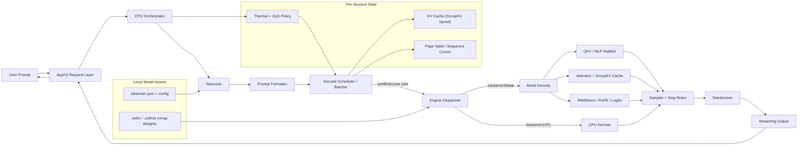

# cellm — Mobile-Native LLM Serving Engine

**cellm** is a ground-up LLM serving engine for iOS and Android, written in Rust. It brings serving-engine concepts — paged KV cache management, continuous decode scheduling, multi-session concurrency, and a high-performance CLI — to phones running under 512MB RAM. 

Not a wrapper around `llama.cpp`. Not a port of `vLLM`. A new runtime designed for mobile constraints from scratch.

## Current Status: Phase 6 (Multimodal Vision)
**cellm** has evolved from an honest baseline into a multimodal-ready inference engine:

- [x] **Paged KV Cache**: Fixed-size block allocation using `BlockAllocator` & `PageTable`.
- [x] **Multi-session Scheduler**: Round-robin interleaved decoding for concurrent users.
- [x] **4-bit Affine Dequantization**: Native support for high-precision 4-bit packed weights from MLX/HF.
- [x] **Multimodal Vision**: Native ViT/SigLIP vision encoder and linear projector integration.
- [x] **Accelerated Math**: Metal (macOS/iOS) compute kernels and SIMD-optimized CPU fallbacks.
- [x] **High-Performance CLI**: Suite of tools for `.cellm` conversion, latency benchmarking, and debug inference.
- [ ] **Vulkan Support**: Cross-platform compute kernels (Active Research).
- [ ] **Android Integration**: Native Kotlin/JNI bindings and performance tuning (Coming Soon).
- [ ] **Qwen iOS Porting**: Integrate and optimize Qwen inference path for native iOS deployment.

## Mobile Inference Dataflow



---

## Why cellm?

> [!NOTE]
> This is just a research project—don't get mad at me lol!

**cellm** is a unique hybrid of server-grade serving concepts (vLLM-style) and mobile-native execution (MLX-style). 

| Feature | `llama.cpp` | `MLX` | `ExecuTorch` | **`cellm`** |
| :--- | :--- | :--- | :--- | :--- |
| **Language** | C++ | C++/Python | C++ | **Rust** |
| **KV Cache** | Contiguous | Contiguous | Contiguous | **Paged (Block-based)** |
| **Focus** | Portability | Apple Native | Model Export | **Mobile Multi-session** |
| **Scheduling** | Static Batch | Mostly Single | N/A | **Round-Robin Interleaved**|
| **Memory** | Manual/Static | Managed Buffer | Static Graph | **Dynamic Block Allocator**|

---

## Getting Started

### Prerequisites
- Rust 1.75+ (Modern toolchain recommended)

### Build
To build the workspace:
```bash
cargo build --release
```

### Run Inference (Smoke Test)
Run unoptimized CPU inference for a `.cellm` model:
```bash
cargo run --release --bin infer -- \
  --model models/smollm2-135m.cellm \
  --tokenizer models/hf/smollm2-135m/tokenizer.json \
  --prompt "Hello, how are you?" \
  --chat \
  --gen 32
```

Notes:
- `--chat` auto-detects ChatML-style tokens (for SmolLM2 this uses `<|im_start|>` / `<|im_end|>`). Without chat formatting, many base models behave like “text completion” and may not answer directly.
- Use `--chat-format plain` to force the simpler `User:/Assistant:` style. `--chat-format auto` (default) only uses ChatML when the tokenizer advertises a chat template in `tokenizer_config.json`.
- `--max-layers` is only for debugging; using fewer layers will significantly degrade quality.
- Backend selection is strict in this build: `--backend cpu` runs CPU only, and `--backend metal` runs Metal only (no automatic fallback).

Run with backend selection:
```bash
# CPU
cargo run --release --bin infer -- \
  --model models/smollm2-135m-int8.cellm \
  --tokenizer models/hf/smollm2-135m/tokenizer.json \
  --prompt "Hello" \
  --chat \
  --gen 16 \
  --backend cpu

# Metal (strict: errors if Metal backend is unavailable)
cargo run --release --bin infer -- \
  --model models/smollm2-135m-int8.cellm \
  --tokenizer models/hf/smollm2-135m/tokenizer.json \
  --prompt "Hello" \
  --chat \
  --gen 16 \
  --backend metal
```

### Fused Kernel Status (April 5, 2026)

- Added fused Metal QKV kernel wiring (`q_proj + k_proj + v_proj` in one launch) in:
  - Llama runtime path
  - Gemma runtime path
  - Qwen runtime path
- Added a high-level MetalOps fused API (`logits_qkv_f16`) with cached GPU weights.
- Llama graph path (`CELLM_LLAMA_ENABLE_GRAPH=1`) remains the fastest path for SmolLM2 in this repo.

Quick benchmark snapshot (`--kv-encoding f16`, `temperature=0`):

| Model | Backend | Config | Prefill | Decode |
|---|---|---|---:|---:|
| SmolLM2-135M | CPU | full layers, gen=12 | 50.20s | 33.32s |
| SmolLM2-135M | Metal | full layers, gen=12 | 74.30s | 50.42s |
| SmolLM2-135M | Metal + graph | `CELLM_LLAMA_ENABLE_GRAPH=1`, gen=12 | 0.48s | 0.32s |
| Qwen3.5-0.8B-int8 | CPU | full layers, gen=8 | 322.27s | 26.26s |
| Qwen3.5-0.8B-int8 | Metal | full layers, gen=8 | 100.08s | 8.15s |
| Gemma-3-1B-it-int8 | CPU | full layers, gen=8 | 284.72s | 140.40s |
| Gemma-3-1B-it-int8 | Metal | full layers, gen=8 | 4.97s | 2.36s |
| Gemma-4-E2B-it-Q4_K_M-from-gguf | CPU | `--max-layers 8`, gen=4 | 250.33s | 66.64s |
| Gemma-4-E2B-it-Q4_K_M-from-gguf | Metal | `--max-layers 8`, gen=4 | 4.48s | 0.86s |

Notes:
- Gemma-4 conversion quality is still unstable for this GGUF-converted checkpoint (latency is improved on Metal, output quality still needs parity fixes).
- The tokenizer warning lines for missing special tokens do not block inference, but the tokenizer files should still be cleaned up for production.

KV encoding selection (safe opt-in):
- Default remains current behavior: `--kv-encoding f16`
- Experimental TurboQuant mode (opt-in only): `--kv-encoding turboquant`
- If you do not pass this flag, nothing changes in your current setup.

TurboQuant reference (cited):
- **TurboQuant: Redefining AI efficiency with extreme compression** (March 24, 2026)
- Amir Zandieh, Research Scientist, and Vahab Mirrokni, VP and Google Fellow, Google Research
- Data-flow note in this repo: `docs/turboquant_dataflow.md`

Current implementation status:
- `cpu + turboquant`: enabled (int8 packed K/V with per-token scales, experimental)
- `metal + turboquant`: enabled (int8 packed K/V with per-token scales, experimental)

Example:
```bash
./target/release/infer \
  --model models/gemma-3-1b-it-int8.cellmd \
  --tokenizer models/hf/gemma-3-1b-it/tokenizer.json \
  --prompt "What is the capital of France?" \
  --chat \
  --chat-format auto \
  --gen 16 \
  --backend metal \
  --kv-encoding turboquant
```

Qwen3.5 notes:
- Qwen3.5 4-bit MLX tokenizers sometimes store BPE merges as `[[a,b], ...]` instead of `["a b", ...]`. `infer` auto-normalizes this on load.
- Qwen3.5 mixes `full_attention` layers and `linear_attention` (DeltaNet / gated delta rule) layers. `infer` includes a CPU reference implementation for both.
- DeltaNet is stateful per session (separate from the paged KV cache). See `docs/qwen3_5-deltanet.md`.

Qwen3.5 quantization findings (March 30, 2026):
- Baseline text+vision `.cellm`: `models/qwen3.5-0.8b.cellm` = `1746.9 MB`
- Int8 weight-only: `models/qwen3.5-0.8b-int8.cellm` = `1706.0 MB`
- Int4 weight-only (all stacks): `models/qwen3.5-0.8b-int4.cellm` = `620.4 MB`
- Int4 weight-only + text-only tensors: `models/qwen3.5-0.8b-int4-textonly.cellm` = `378.3 MB` (< 500MB)

Create Qwen3.5 int4:
```bash
./target/release/convert \
  --input models/hf/qwen3.5-0.8b \
  --output models/qwen3.5-0.8b-int4.cellm \
  --quantize-int4-symmetric
```

Create Qwen3.5 int4 text-only:
```bash
./target/release/convert \
  --input models/hf/qwen3.5-0.8b \
  --output models/qwen3.5-0.8b-int4-textonly.cellm \
  --quantize-int4-symmetric \
  --text-only
```

Run prompt test on `qwen3.5-0.8b-int4.cellm`:
```bash
./target/release/infer \
  --model models/qwen3.5-0.8b-int4.cellm \
  --tokenizer models/hf/qwen3.5-0.8b/tokenizer.json \
  --prompt "Write one short sentence about Rust programming." \
  --chat \
  --chat-format chatml \
  --gen 24 \
  --temperature 0
```

Sample output:
```text
Rust programming serves as a concise and concise language that simplifies the creation of programs, making it easier to understand the
```

Qwen int4 Metal run note:
- `--backend metal` currently reports: `Backend: metal (smoke ok). Forward path currently uses CPU math kernels.`
- This means Metal device/kernel smoke passes, but Qwen forward execution in `infer` is still CPU-path today.

Repro command:
```bash
./target/release/infer \
  --model models/qwen3.5-0.8b-int4-textonly.cellm \
  --tokenizer models/hf/qwen3.5-0.8b/tokenizer.json \
  --prompt "Return exactly one uppercase letter: R" \
  --chat \
  --chat-format chatml \
  --gen 4 \
  --temperature 0 \
  --backend metal
```

Run prompt test on `qwen3.5-0.8b-int4-textonly.cellm`:
```bash
./target/release/infer \
  --model models/qwen3.5-0.8b-int4-textonly.cellm \
  --tokenizer models/hf/qwen3.5-0.8b/tokenizer.json \
  --prompt "Write one short sentence about Rust programming." \
  --chat \
  --chat-format chatml \
  --gen 24 \
  --temperature 0
```

Sample output:
```text
Rust programming serves as a concise and concise language that simplifies the creation of programs, making it easier to understand the
```

FunctionGemma mobile-actions (Gemma3 text) action smoke test:
```bash
./target/release/infer \
  --model models/functiongemma-270m-mobile-actions.cellm \
  --tokenizer models/hf/functiongemma-270m-mobile-actions/mobile/tokenizer.json \
  --prompt "You are a phone automation model. User request: Turn on Wi-Fi and open Settings. Return only a short action plan." \
  --chat \
  --chat-format plain \
  --gen 32 \
  --temperature 0 \
  --backend metal
```

Note:
- This confirms Gemma linear layers run on Metal (`LLM linear backend: metal (Gemma linear layers)`).
- Current output quality for this converted mobile checkpoint is still poor/repetitive; architecture support is in active bring-up.

Observed output (April 3, 2026):
```text
setPrototypeOfsetPrototypeOfsetPrototypeOf...
```

Gemma3-1B prompt validation (April 3, 2026):

Model:
- `models/gemma-3-1b-it.cellmd`
- `models/gemma-3-1b-it-int8.cellmd` (quantized with `--quantize-int8-symmetric`)

Prompts and observed outputs:

```bash
./target/release/infer \
  --model models/gemma-3-1b-it.cellmd \
  --tokenizer models/hf/gemma-3-1b-it/tokenizer.json \
  --prompt "What is 84 * 3 / 2? Answer with only the number." \
  --chat --chat-format auto --temperature 0 --gen 8 --stop-eos --backend metal
```

```text
24
```

```bash
./target/release/infer \
  --model models/gemma-3-1b-it.cellmd \
  --tokenizer models/hf/gemma-3-1b-it/tokenizer.json \
  --prompt "If I buy 12 donuts and eat 5, how many donuts are left for tomorrow? Explain each step of your reasoning." \
  --chat --chat-format auto --temperature 0 --gen 96 --stop-eos --backend cpu
```

```text
... Answer: You have 7 donuts left for tomorrow.
```

```bash
./target/release/infer \
  --model models/gemma-3-1b-it.cellmd \
  --tokenizer models/hf/gemma-3-1b-it/tokenizer.json \
  --prompt "Translate these phrases into casual Italian:\nInput: 'Hello, how are you?'" \
  --chat --chat-format auto --temperature 0 --gen 48 --stop-eos --backend cpu
```

```text
Ciao, come stai?
```

Note:
- For Gemma3, `--backend metal` currently runs Metal smoke but uses CPU math path for correctness (full Gemma3 Metal parity is still in progress).

Supported Mobile Actions (reference prompts):

| Function | Example Prompt |
| --- | --- |
| Flashlight | "Turn on the flashlight" |
| Contacts | "Create a contact for John Doe with phone 555-1234" |
| Email | "Send email to john@example.com" |
| Maps | "Show Times Square on the map" |
| WiFi | "Turn off WiFi" |
| Calendar | "Create a calendar event for Team Meeting tomorrow at 2 PM" |

### Run VLM (SmolVLM-256M via ONNX, Rust validation)
SmolVLM-256M-Instruct ships official ONNX exports (`vision_encoder`, `embed_tokens`, `decoder_model_merged`). For quick local validation on macOS, use:

```bash
cargo build --release -p cellm-vlm-onnx-infer

./target/release/vlm-infer \
  --model-dir models/hf/smolvlm-256m-instruct \
  --onnx-variant fp16 \
  --image models/test_images/rococo.jpg \
  --prompt "Describe this image in detail." \
  --backend cpu \
  --split-image \
  --max-new-tokens 128
```

Recommended “works now” test command:

```bash
./target/release/vlm-infer \
  --model-dir models/hf/smolvlm-256m-instruct \
  --onnx-variant fp16 \
  --image models/test_images/rococo.jpg \
  --prompt "Describe this image." \
  --split-image \
  --max-new-tokens 96 \
  --min-new-tokens 24 \
  --temperature 0.7 \
  --top-k 40 \
  --seed 1
```

Second image test:

```bash
./target/release/vlm-infer \
  --model-dir models/hf/smolvlm-256m-instruct \
  --onnx-variant fp16 \
  --image models/test_images/rococo_1.jpg \
  --prompt "Describe this image." \
  --split-image \
  --max-new-tokens 96 \
  --min-new-tokens 24 \
  --temperature 0.7 \
  --top-k 40 \
  --seed 1
```

Notes:
- Use `--split-image` for best quality on detailed scenes (global + local tiles). It is slower, but improves caption relevance.
- Keep `--split-image` off for faster smoke tests.
- `vlm-infer` now computes decoder `position_ids` from the full attention history and grows `attention_mask` across decode steps, which fixes repetitive/garbled outputs from earlier builds.

Native `.cellm` decoder path (experimental):
```bash
./target/release/vlm-infer \
  --model-dir models/hf/smolvlm-256m-instruct \
  --cellm-model models/smolvlm-256m-int8.cellm \
  --decoder-backend cellm \
  --onnx-variant fp16 \
  --image models/test_images/rococo.jpg \
  --prompt "Describe this image." \
  --max-new-tokens 24
```
- This uses ONNX for vision encoding and native `.cellm` for decoder text-stack execution.

Native `.cellm` vision + decoder path (experimental):
```bash
./target/release/vlm-infer \
  --model-dir models/hf/smolvlm-256m-instruct \
  --cellm-model models/smolvlm-256m.cellm \
  --vision-backend cellm \
  --decoder-backend cellm \
  --image models/test_images/rococo.jpg \
  --prompt "Describe this image." \
  --max-new-tokens 12
```
- This bypasses ONNX model execution for both vision and decoder.
- Native vision now runs a full ViT encoder path in Rust (patch embed + 12 transformer blocks + post layernorm + connector projection).
- The native path now uses SIMD-optimized BLAS (`Accelerate` SGEMM on macOS) for linear layers and attention matmuls.
- Current limitation: ONNX Runtime is still faster for vision on the same machine.

SDK FFI VLM smoke test (same native `.cellm` vision+decoder stack used by iOS):
```bash
CELLM_VLM_TOKENIZER=models/hf/smolvlm-256m-instruct/tokenizer.json \
cargo run --release --bin vlm-smoke -- \
  --model models/smolvlm-256m-int8.cellm \
  --image models/test_images/rococo_1.jpg \
  --prompt "Describe this image."
```

Run VLM with backend selection:
```bash
# ONNX vision+decoder, CPU backend selection
./target/release/vlm-infer \
  --model-dir models/hf/smolvlm-256m-instruct \
  --onnx-variant fp16 \
  --image models/test_images/rococo.jpg \
  --prompt "Describe this image." \
  --backend cpu

# ONNX vision+decoder, Metal requested (auto-fallback if unavailable)
./target/release/vlm-infer \
  --model-dir models/hf/smolvlm-256m-instruct \
  --onnx-variant fp16 \
  --image models/test_images/rococo.jpg \
  --prompt "Describe this image." \
  --backend metal
```

See [`docs/vlm-smolvlm-onnx.md`](docs/vlm-smolvlm-onnx.md) for details, debug flags, and current limitations.
Sequence progress is tracked in [`docs/cellm-vlm-sequence.md`](docs/cellm-vlm-sequence.md).

### Run Benchmarks
Test the latency and memory throughput of the engine:
```bash
# Run with tiny test configuration
cargo run --release --bin bench -- --model tiny

# Run with SmolLM2-135M configuration
cargo run --release --bin bench -- --model smollm2-135m --seq 128 --gen 64

# Automated CPU vs Metal 3-pass LLM matrix (SmolLM2, Gemma, Qwen)
tools/bench/run_llm_backend_matrix.sh
```

Recent run-time snapshots (measured locally on March 29, 2026; these are reference numbers, not guaranteed across machines):
| Run | Key Params | Vision Time | Prefill Time | Decode Time |
|---|---|---:|---:|---:|
| `infer` | `smollm2-135m.cellm`, 30 layers, prompt `"Hello, how are you?"`, `--chat`, `--gen 8` | N/A | `12` tokens in `2.35s` | `8` tokens in `1.62s` |
| `infer` | `smollm2-135m-int8.cellm`, prompt `"Hello, how are you?"`, `--chat`, `--gen 16` | N/A | `12` tokens in `2.38s` | `16` tokens in `3.36s` |
| `vlm-infer` ONNX fp16 | `rococo.jpg`, `--max-new-tokens 16` | `[64, 576]` in `0.99s` | N/A | `16` tokens in `1.54s` |
| `vlm-infer` ONNX quantized | `rococo.jpg`, `--onnx-variant quantized`, `--max-new-tokens 24` | `[64, 576]` in `1.44s` | N/A | `18` tokens in `0.35s` (EOS step `17`) |
| `vlm-infer` native vision + ONNX decoder | `rococo.jpg`, `--vision-backend cellm --decoder-backend onnx --max-new-tokens 16` | `[64, 576]` in `5.96s` | N/A | `16` tokens in `4.15s` |
| `vlm-infer` native vision + native decoder | `rococo.jpg`, `--vision-backend cellm --decoder-backend cellm --max-new-tokens 24` | `[64, 576]` in `5.65s` | N/A | `24` tokens in `18.39s` |

CPU vs Metal request benchmark (same prompts/settings, local run on March 29, 2026):
| Tool | Backend Arg | Host Log | Vision Time | Prefill Time | Decode Time |
|---|---|---|---:|---:|---:|
| `infer` (`smollm2-135m-int8`, `--gen 16`) | `--backend cpu` | `Backend: cpu (macos/aarch64)` | N/A | `12` tokens in `1.77s` | `16` tokens in `2.07s` |
| `infer` (`smollm2-135m-int8`, `--gen 16`) | `--backend metal` | `Backend: metal (smoke ok)` | N/A | `12` tokens in `1.75s` | `16` tokens in `2.07s` |
| `vlm-infer` (`fp16`, `rococo.jpg`, `--max-new-tokens 16`) | `--backend cpu` | `Backend: cpu (macos/aarch64)` | `[64, 576]` in `2.28s` | N/A | `16` tokens in `2.37s` |
| `vlm-infer` (`fp16`, `rococo.jpg`, `--max-new-tokens 16`) | `--backend metal` | `Backend: metal (smoke ok)` | `[64, 576]` in `1.85s` | N/A | `16` tokens in `2.56s` |

CPU vs Metal LLM benchmark snapshot (3 passes, host macOS run on April 3, 2026; prompt=`"hi"`, `--gen 8`, report = median / P95):
| Model | Backend | Startup (s) | Prefill (s) | Decode (s) |
|---|---|---:|---:|---:|
| `smollm2-135m-int8.cellm` | `cpu` | `0.04 / 0.05` | `0.07 / 0.53` | `0.48 / 0.49` |
| `smollm2-135m-int8.cellm` | `metal` | `0.09 / 0.10` | `0.20 / 0.24` | `0.95 / 1.59` |
| `gemma-3-1b-it-int8.cellmd` | `cpu` | `1.03 / 1.05` | `0.56 / 3.10` | `4.11 / 4.16` |
| `gemma-3-1b-it-int8.cellmd` | `metal` | `1.05 / 1.06` | `0.62 / 0.66` | `2.07 / 2.33` |
| `qwen3.5-0.8b-int8.cellm` | `cpu` | `0.26 / 0.28` | `0.52 / 1.80` | `3.87 / 3.89` |
| `qwen3.5-0.8b-int8.cellm` | `metal` | `0.33 / 0.33` | `0.42 / 0.46` | `2.08 / 2.08` |

KV encoding benchmark snapshot (3 passes, host macOS run on April 4, 2026; model=`smollm2-135m.cellm`, prompt=`"hello"`, `--gen 8`, report = median / P95):
| Backend | KV Encoding | Prefill (s) | Decode (s) |
|---|---|---:|---:|
| `cpu` | `f16` | `2.85 / 4.30` | `22.22 / 24.20` |
| `cpu` | `turboquant` | `2.79 / 2.80` | `22.19 / 23.31` |
| `metal` | `f16` | `4.72 / 4.79` | `36.83 / 37.15` |
| `metal` | `turboquant` | `4.69 / 4.73` | `37.41 / 37.56` |

Gemma3 int8 strict backend check (April 4, 2026; prompt=`"What is the capital of France?"`, `--gen 16`, `--temperature 0`):
| Model | Backend | Init total before prefill | Prefill | Decode |
|---|---|---:|---:|---:|
| `gemma-3-1b-it-int8.cellmd` | `cpu` | `5.23s` | `8` tokens in `75.84s` | `16` tokens in `147.06s` |
| `gemma-3-1b-it-int8.cellmd` | `metal` | `5.51s` | `8` tokens in `3.32s` | `16` tokens in `3.97s` |

Initialization breakdown from this run:
| Backend | backend check | model header | runner init | metal init | tokenizer load | prompt encode | KV init |
|---|---:|---:|---:|---:|---:|---:|---:|
| `cpu` | `0.00s` | `0.00s` | `0.00s` | N/A | `4.23s` | `0.99s` | `0.00s` |
| `metal` | `0.07s` | `0.00s` | `0.00s` | `0.00s` | `4.41s` | `1.02s` | `0.01s` |

Takeaways from this run:
- Gemma gets a clear Metal decode win (`4.11s` -> `2.07s` median).
- Qwen gets a clear Metal win for both prefill and decode.
- SmolLM2 prefill is faster on Metal, but decode is still faster on CPU in this setup.

Note: in restricted/sandboxed shells, Metal device discovery can fail. `infer --backend metal` now errors instead of silently falling back.

For a dedicated benchmark page (commands + tables), see `docs/benchmarks/README.md`.

Metal troubleshooting:
```bash
# 1) Verify Metal device access
cargo run --release --bin metal-smoke

# 2) Verify infer picks Metal
./target/release/infer \
  --model models/smollm2-135m-int8.cellm \
  --tokenizer models/hf/smollm2-135m/tokenizer.json \
  --prompt "hello" \
  --gen 8 \
  --backend metal

# 3) Llama metal tuning knobs
# Default now keeps Llama norm/RoPE on CPU (often faster for small models like SmolLM2)
# You can force Metal norm/RoPE if you want to compare:
CELLM_LLAMA_USE_METAL_NORM=1 CELLM_LLAMA_USE_METAL_ROPE=1 ./target/release/infer ...

# Experimental fused graph path (can be faster but may be unstable depending on model)
CELLM_LLAMA_ENABLE_GRAPH=1 ./target/release/infer ...
```

Gemma Metal parity controls (for debugging quality vs speed):
```bash
# Default (recommended for Gemma-3 quality parity):
# Metal backend active, but Gemma norm/rope/logits stay on CPU-safe path.

# Opt-in toggles (experimental):
CELLM_GEMMA_USE_METAL_NORM=1   # enable Metal RMSNorm
CELLM_GEMMA_USE_METAL_ROPE=1   # enable Metal RoPE
CELLM_GEMMA_USE_METAL_LOGITS=1 # enable Metal final logits matvec
```

### Convert Models
(Local) Convert HuggingFace safetensors to `.cellm`:
```bash
cargo run --bin convert -- \
  --input  ./models/hf/smollm2-135m \
  --output ./models/smollm2-135m.cellm \
  --dtype  f16
```

PyTorch checkpoint import (`.bin` / `.pt`) is also supported (auto-converted to temporary safetensors first):
```bash
cargo run --bin convert -- \
  --input  ./models/hf/some-model/pytorch_model.bin \
  --output ./models/some-model.cellm \
  --dtype  f16
```

GGUF note:
- `convert` accepts Llama GGUF and converts to `.cellm` (`f16` output).
- Supported GGUF tensor types in this path: `BF16`, `F16`, `F32`, `Q4_K`, `Q6_K`.
- `Q4_K`/`Q6_K` are dequantized during conversion (output remains `f16` in `.cellm`).

Example (GGUF -> cellm):
```bash
cargo run --release --bin convert -- \
  --input  ./models/hf/Llama-3.2-1B-Instruct-GGUF/Llama-3.2-1B-Instruct-bf16.gguf \
  --output ./models/llama32-1b-bf16-from-gguf.cellm \
  --dtype  f16
```

Prompt sanity check on Metal (April 3, 2026):

```bash
./target/release/infer \
  --model models/llama32-1b-bf16-from-gguf.cellm \
  --tokenizer models/hf/unsloth-Llama-3.2-1B-Instruct/tokenizer.json \
  --prompt "What is 84 * 3 / 2? Answer with only the number." \
  --temperature 0 \
  --gen 8 \
  --backend metal
```

Observed first answer token across `bf16`, `q4k`, and `q6k` conversions:

```text
168
```

Note:
- This is a useful correctness smoke test, and currently fails for this plain-prompt setup.
- Prefer a chat-formatted eval set (and multiple prompts) before drawing quality conclusions for these converted checkpoints.

Working quantization option (Llama text stacks):
```bash
cargo run --bin convert -- \
  --input  ./models/hf/smollm2-135m \
  --output ./models/smollm2-135m-int8.cellm \
  --dtype  f16 \
  --quantize-int8-symmetric
```
- This is weight-only per-row symmetric int8 for attention/MLP linear weights.
- `infer` runs these quantized weights directly (with per-row f16 scales).

Multimodal checkpoints (example: SmolVLM):
- `convert` now reads `text_config.model_type` (not just top-level `model_type`) when writing `.cellm`, so multimodal wrappers can map to the correct text backbone runner (`llama`/`qwen`) in `infer`/SDK.
- `.cellm` headers now include VLM-aware sections: `text_tensor_prefix`, `vision_tensor_prefix`, `projector_tensor_prefix`, plus source `vision_config`/projector config metadata.
- If conversion fails with `metadata incomplete`, the local `.safetensors` file is truncated and must be re-downloaded before conversion.
- Keep enough free disk space for conversion (typically at least model_size + output_size + working headroom).
- Native `.cellm` VLM execution is now available in `vlm-infer` with `--vision-backend cellm --decoder-backend cellm` (experimental CPU path).

Quantized validation status:
- Text (quantized `.cellm`): tested and working.
- `smollm2-135m-int8.cellm` runs in `infer` and generates output.
- `smolvlm-256m-int8.cellm` also runs through the text path (`infer`).
- Qwen3.5 int8 parity note: for `qwen3.5-0.8b-int8.cellm`, keep `linear_attn.*` projection weights in f16 during quantization (do not int8 those tensors) to avoid degenerate output.
- Vision (quantized): tested with ONNX VLM path (`vlm-infer --onnx-variant quantized`) and produces image-relevant captions.
- Native `.cellm` vision execution is implemented in `vlm-infer` (`--vision-backend cellm`) and tested with both ONNX and native decoders.
- Native `.cellm` vision currently prioritizes correctness over speed (CPU-only Rust math, no fused kernels yet).

Quantized sizes:
- `models/smollm2-135m.cellm`: `257M`
- `models/smollm2-135m-int8.cellm`: `156M` (~39% smaller)
- `models/smolvlm-256m.cellm`: `489M`
- `models/smolvlm-256m-int8.cellm`: `308M` (~37% smaller)

Quantized checkpoints:
- Some HF folders (e.g. 4-bit affine: `uint32` packed weights + `*.scales`/`*.biases`) require expanding weights to f16 during conversion: add `--dequant-4bit-affine`. This increases output size.

**Recommended Model**: [SmolLM2-135M](https://huggingface.co/HuggingFaceTB/SmolLM2-135M/tree/main)

### Sample Models
Sample `.cellm` checkpoints are included in the repository (tracked via Git LFS) and can be used for immediate testing:
- `models/smollm2-135m-int8.cellm`
- `models/smolvlm-256m-int8.cellm`
- `models/qwen3.5-0.8b-int4-textonly.cellm`


---

## Directory Structure
- `crates/cellm-core`: Memory arena, tensor layout, and op dispatch.
- `crates/cellm-model`: Model format, configuration, and weight management.
- `crates/cellm-cache`: Paged KV cache building blocks (allocator, page table, physical KV storage).
- `crates/cellm-sdk`: High-level public API for mobile consumers.
- `tools/bench`: Benchmark harness for TTFT and tok/s metrics.
- `tools/convert`: HuggingFace to `.cellm` conversion pipeline.
- `tools/infer`: Simple Rust inference runner for debugging models and cache behavior.
- `tools/vlm-onnx-infer`: Rust runner for SmolVLM ONNX exports (VLM validation on desktop).

---

*Phase 6 provides native vision-language reasoning on device.*

See `docs/paged-kv-cache-foundation.md` for a plain-English walkthrough of the BlockAllocator/PageTable/KVCache foundation.

### Metal Smoke Test (macOS)
Verify the Metal toolchain works on Apple Silicon/macOS (compile + dispatch a tiny compute kernel):
```bash
cargo run --release --bin metal-smoke
```

### Build Swift XCFramework (iOS + macOS)
Build `bindings/swift/CellmFFI.xcframework` (staticlib + headers) so the Swift package works on both macOS (M-series dev) and iOS:
```bash
./scripts/build_xcframework.sh
```

### iOS Demo App (LLM now, VLM stub)
There is a small SwiftUI demo app scaffold under:
- `bindings/ios/CellmDemo`

It uses the C FFI from `cellm-sdk`:
- `cellm_engine_create_v3(...)` for engine + sampling + backend config (`cpu` / `metal`)
- `cellm_engine_backend_name(...)` to confirm active backend in-app
- `cellm_tokenizer_create/encode/decode(...)` for prompt tokenization in-app

See `bindings/ios/CellmDemo/README.md` for the Xcode steps.

## Design References

- **Sampling PRNG**: `cellm` uses simple, high-performance PRNGs for stochastic sampling.
  - [Linear Congruential Generator (LCG)](https://en.wikipedia.org/wiki/Linear_congruential_generator) — Background on simple PRNG architectures.
  - Xorshift — The specific 64-bit implementation used in `cellm-sdk`.

## License

Licensed under either of:

- MIT license (`LICENSE-MIT`)
- Apache License, Version 2.0 (`LICENSE-APACHE`)

at your option.
