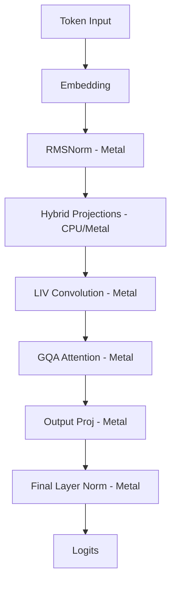

# LFM 2.5 Metal Acceleration

This document outlines the implementation of hardware acceleration for Liquid Foundation Models (LFM 2.5) using the Metal backend.

## Architectural Overview

The acceleration strategy uses a hybrid approach to balance memory efficiency and execution speed. Large 4-bit quantized projections are dequantized on the CPU and cached as 32-bit floats on the GPU, while sensitive layers like LIV Convolution and RMSNorm remain in 16-bit float format.

## Key Components

### 1. Hybrid 4-bit Projection Path

For models using MLX-style 4-bit quantization, the system avoids the complexity of real-time 4-bit dequantization on the GPU by using a tiered cache:

1. CPU dequantizes packed u32 nibbles into f32 weights once.
2. The resulting f32 tensor is uploaded to a persistent Metal buffer.
3. Subsequent tokens use a dedicated mv_f32 kernel for matrix-vector multiplication.

### 2. LIV Convolution State Management

The Linear Input-Varying (LIV) convolution requires persisting history across tokens. The implementation ensures that the convolution state is synchronized between the host and device to prevent stale history artifacts.

- Host maintains the master convolution state.
- Device updates the state buffer during the lfm_conv kernel execution.
- Updated state is read back to the host after each step to maintain continuity.

### 3. Performance Metrics

The implementation provides significant throughput improvements on Apple Silicon compared to pure CPU execution.

- Architecture: LFM 2.5 350M
- Backend: Metal (Aarch64)
- Throughput: ~13.2 tokens per second
- Latency: ~2.43s for 32 generated tokens

## Summary of Optimization

The combination of persistent GPU caching for large weights and dedicated kernels for LFM-specific operations (LIV Conv, Split-RoPE) allows the 350M parameter model to run near real-time on mobile and desktop hardware without the overhead of full model dequantization on every step.
