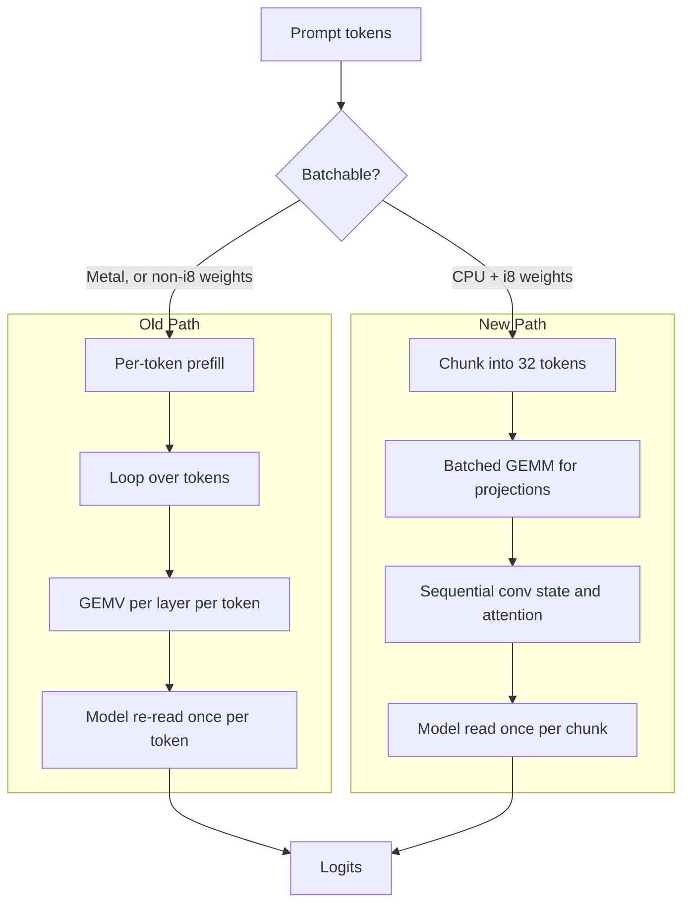

# Batched Prefill

<div style="text-align: right; font-size: 0.9em; color: gray;">July 31, 2026</div>

This document explains how we made prompt processing 4.5x faster on CPU by
batching the prefill pass, and why the change is safe enough to ship without
re-validating model quality.

## The Problem

Feeding a 747 token prompt to a 350M parameter model took **12.27 seconds**
before a single token of output appeared. Generation afterwards was fine. The
cost was entirely in prefill.

The inspiration for the fix came from llama.cpp. Its benchmark tool reports two
separate numbers, `pp512` for prompt processing and `tg128` for token
generation, and prompt processing is routinely an order of magnitude faster per
token. That gap is not a better kernel. It exists because generation is forced
to work one token at a time, since each token depends on the one before it,
while a prompt is fully known up front and can be pushed through as a batch.

Our prefill was not taking that option. It ran a plain loop:

```
for token in prompt {
    forward_one_token()
}
```

which means prefill was running at the generation speed limit.

### The arithmetic

Every token's forward pass reads the entire model. For this model the
non-embedding weights are 287 MB, so a 747 token prompt moves:

```
287 MB x 747 tokens = 214 GB
```

Measured single thread memory bandwidth on the test machine (Apple M4) is about
24 GB/s, giving roughly 9 seconds of unavoidable memory traffic. We observed
12.2 seconds.

The kernel was never slow. It was being asked to read the model 747 times.

This distinction matters, because it tells you the workload is memory bound
rather than compute bound. The arithmetic was already close to free, so there
was nothing to gain from a faster inner loop and everything to gain from
touching memory less often.

## The Solution

Raise arithmetic intensity: do more work per weight byte fetched. Instead of a
matrix-vector product against a single token, load a weight row once and dot it
against many token columns at once.

| Path | Work per weight byte |
| --- | --- |
| GEMV (1 token) | 1 multiply-accumulate |
| GEMM (32 tokens) | 32 multiply-accumulates |

Weight traffic falls by the batch factor. Three details make this work in
practice:

**Register blocking.** The inner tile in `gemm_i8_dot_tile` holds 4 weight rows
by 4 tokens, producing 16 SDOT chains per pair of loads. Each weight byte does
four times the work it did in the GEMV before leaving registers, with the rest
of the saving coming from the outer loop over tokens.

**Quantize activations once per batch.** The row loop reuses the same quantized
token columns for every output row, so activation quantization is paid once per
batch rather than once per row.

**Split parallel work by weight rows, not by tokens.** Each thread then walks a
disjoint, contiguous slice of the weight matrix and reads its share exactly
once. Because the output buffer is token-major while the split is row-major,
this needed a small raw pointer wrapper; `par_chunks_mut` cannot express that
shape.

Prompts are processed in chunks of 32 tokens rather than all at once. This
mirrors llama.cpp's `n_ubatch`: large enough to amortize the weight read, small
enough that activation scratch stays in cache.

## What Stays Sequential

Only the linear layers are batched. Convolution state rolling and attention are
genuinely sequential over positions, because position `t` depends on the state
left behind by position `t-1`. Those still run per token inside each chunk.

This costs almost nothing. The 287 MB was all in the projections; the recurrent
and attention steps touch tiny amounts of memory by comparison.

## Execution Map



## Results

| Prompt | Before | After | Speedup |
| --- | --- | --- | --- |
| 747 tokens | 12.27s | **2.74s** | 4.5x |
| 745 tokens | 12.42s | **3.11s** | 4.0x |
| 88 tokens | 1.77s | **0.20s** | 8.9x |

Prefill throughput rose from 61 to 273 tokens per second. End to end wall time
on a representative task fell from 19.29s to 10.11s.

A standalone microbenchmark on the model's real layer shapes shows 3x to 7x at
batch sizes 16 to 32, which is what led us to pick 32 as the chunk size.

## Correctness

The output is **byte identical**, not merely close.

Accumulation order within a row is unchanged from the GEMV, so the results match
bit for bit. This is verified two ways:

- A unit test compares batched GEMM against per-token GEMV across six shapes
  using exact `f32::to_bits()` equality.
- End to end, generated text is compared by SHA256 at temperature 0.0, where
  greedy decoding makes the model a deterministic function of its input. Three
  prompts, including one shorter than a single chunk and one with a ragged final
  chunk, produce identical hashes on both paths.

Bit identity is the property that makes this a safe change rather than a risky
one. A batching rewrite that merely looked about right would be hard to trust,
because small numerical drift can change a sampled token and cascade. This one
cannot silently alter behavior.

To support that guarantee, the batched path can be disabled at runtime with
`CELLM_BATCHED_PREFILL=0`, and the two paths are expected to agree exactly
rather than approximately.

## Limitations

The batched path is gated to CPU execution with i8 weights. It is skipped when
Metal is active, and when any projection in a layer is not i8.

The same per-token prefill pattern still exists in the Llama runner. The batched
kernel is now available to fix it the same way.
