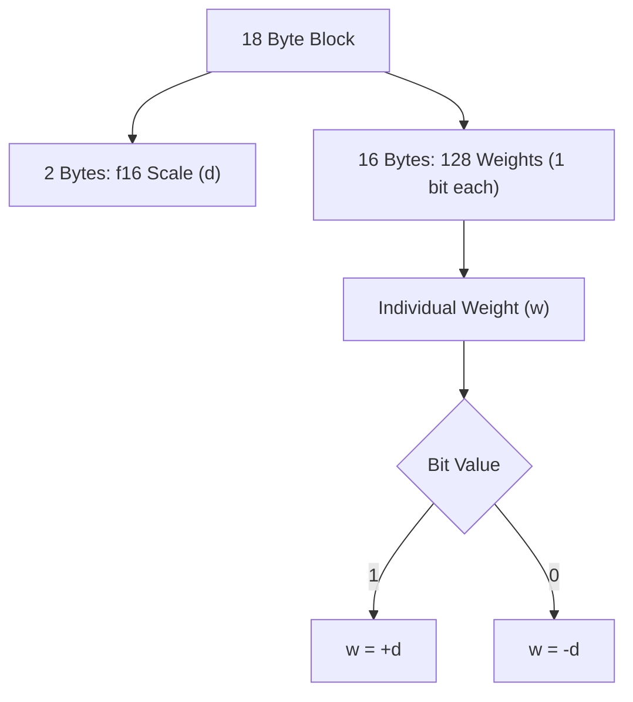

# Bonsai 1-Bit Implementation Analysis

This document describes how the 1-bit quantization format from the Bonsai 1.7B model was analyzed and implemented for the cellm framework.

## Format Identification

The original model was provided in GGUF format. Analysis of the tensor metadata revealed that the primary weights used the Q1_0_g128 type. This is a specialized quantization scheme that targets approximately 1 bit per parameter by using grouped sign-magnitude logic.

## Binary Structure

The Q1_0_g128 format organizes weights into blocks. Each block represents 128 individual parameters and occupies 18 bytes of memory.

## Decoding Logic

The reconstruction of a weight from this binary format follows a simple rule. The first two bytes are interpreted as a half-precision float which defines the magnitude. The following 128 bits serve as sign indicators.

1. Read the 16-bit scale factor (d).
2. Iterate through the 16 bytes of bit data.
3. For each bit in a byte:
    * If the bit is 1, the weight is +d.
    * If the bit is 0, the weight is -d.

## Implementation in cellm

To support this format without information loss, the cellm converter was updated with a raw copy path. When the converter encounters a Q1_0_g128 tensor in a GGUF file, it performs a bit-for-bit copy into the .cellm container. This ensures that the original quantization is preserved exactly as it was trained.

The inference engine uses a specialized Metal kernel to perform matrix-vector multiplication directly on these packed bits. This avoids the need to decompress the model into a larger format like f16 during runtime, keeping the memory footprint at the theoretical minimum of 1.125 bits per parameter.
