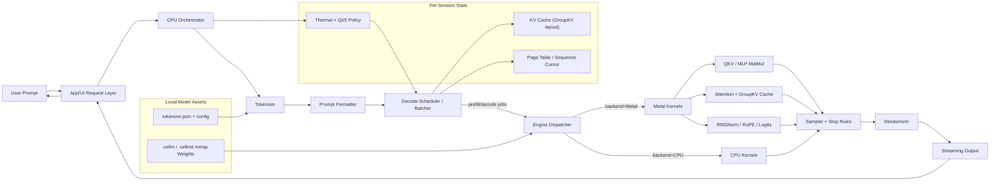

# Cellm Mobile Inference Data Flow

This diagram illustrates the data flow for mobile inference in the cellm project.

```mermaid
flowchart LR
    U["User Prompt"] --> API["App/UI Request Layer"]
    API --> ORCH["CPU Orchestrator"]
    ORCH --> TOK[Tokenizer]
    TOK --> FMT["Prompt Formatter"]
    FMT --> SCH["Decode Scheduler / Batcher"]

    SCH -->|"prefill/decode jobs"| ENG["Engine Dispatcher"]
    ENG -->|backend=CPU| CPUPATH["CPU Kernels"]
    ENG -->|backend=Metal| METAL["Metal Kernels"]

    METAL --> MATMUL["QKV / MLP MatMul"]
    METAL --> ATTN["Attention + GroupKV Cache"]
    METAL --> NORM["RMSNorm / RoPE / Logits"]
    MATMUL --> SAMPLER
    ATTN --> SAMPLER
    NORM --> SAMPLER
    CPUPATH --> SAMPLER["Sampler + Stop Rules"]

    SAMPLER --> DETOK[Detokenizer]
    DETOK --> STREAM["Streaming Output"]
    STREAM --> API
    API --> U

    subgraph ModelAssets["Local Model Assets"]
      W[".cellm / .cellmd mmap Weights"]
      T["tokenizer.json + config"]
    end

    W --> ENG
    T --> TOK

    subgraph SessionState["Per-Session State"]
      KV["KV Cache (GroupKV layout)"]
      PT["Page Table / Sequence Cursor"]
      TH["Thermal + QoS Policy"]
    end

    SCH --> KV
    SCH --> PT
    ORCH --> TH
    TH --> SCH
```
