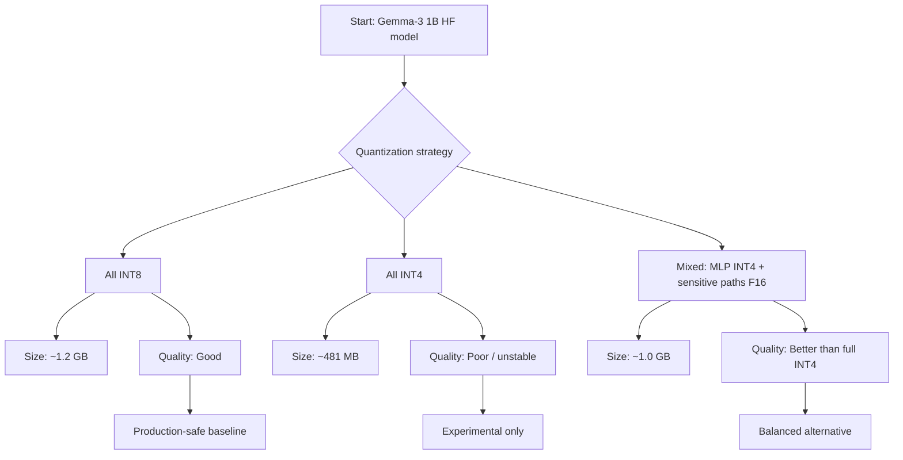
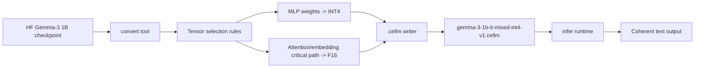

# Why We Made Gemma-3 Mixed Quantization

## Context
We tested multiple quantization strategies for `gemma-3-1b-it` in `cellm` and found a clear size-vs-quality tradeoff:

- `int8` (`gemma-3-1b-it-int8-v1.cellm`): good quality, larger size (~1.2 GB)
- `int4` (`gemma-3-1b-it-int4-v1.cellm`): small size (~481 MB), poor output quality

The pure `int4` variant was too aggressive for stable generation quality in practical prompts.

## Why Mixed Was Introduced
The mixed approach was created to keep quality-critical parts in higher precision while still reducing model size:

- Keep embeddings / attention path higher precision (f16)
- Quantize MLP-heavy weights to int4

This gives a better middle ground:

- `mixed-int4` (`gemma-3-1b-it-mixed-int4-v1.cellm`): ~1.0 GB
- Quality notably better than full int4 and acceptable for normal text prompts

## Core Idea
Not all tensors contribute equally to generation stability.

- Aggressively quantizing everything can introduce compounding errors in token prediction.
- MLP quantization gives substantial size savings.
- Preserving sensitive paths helps maintain coherent output.

## Decision Flow

## Model Pipeline (Mixed)

## Practical Recommendation

- Use `int8` for highest reliability.
- Use `mixed-int4` when you need smaller size with reasonable quality.
- Avoid full `int4` for user-facing quality-sensitive generation.

## Related Artifacts
- `models/gemma-3-1b-it-int8-v1.cellm`
- `models/gemma-3-1b-it-int4-v1.cellm`
- `models/gemma-3-1b-it-mixed-int4-v1.cellm`
