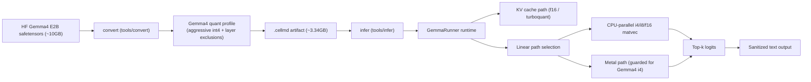
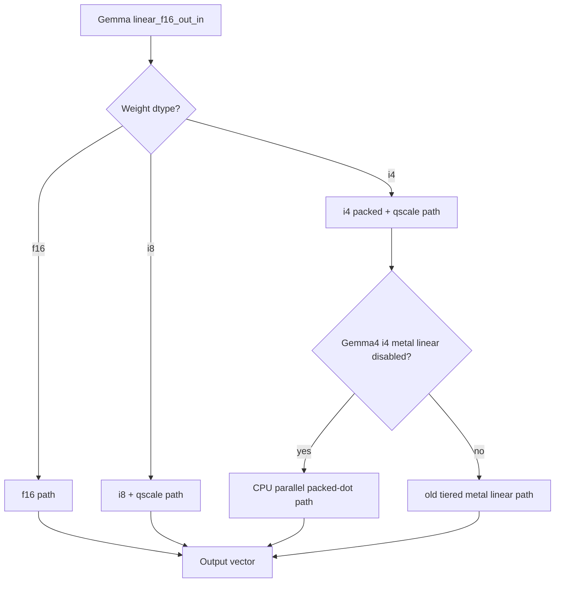

# Gemma4: 10GB to 3.4GB (Mobile Journey)

## Goal

Take Gemma4 E2B from the original ~10GB safetensors checkpoint to a smaller `.cellmd` artifact that still gives usable quality and speed on edge/mobile-style runtimes.

## Final Result

- Source model: `models/gemma-4-E2B-it/model.safetensors` (~10.2GB)
- Final small working artifact: `models/gemma-4-E2B-it-int4-aggr-v5.cellmd` (~3.34GB on disk)
- Runtime status: edge-usable after runtime optimization pass

## What We Changed

### 1. Conversion and quantization strategy

- Added Gemma4 quantization profiles in converter:
  - aggressive int4
  - balanced int4
  - awq-lite int4
  - mixed i8/i4 experiments
- Added layer exclusion controls for sensitive layers:
  - `--gemma4-int4-exclude-layers ...`
- Used aggressive int4 with selective exclusions to keep size low while preserving coherence.

Key converter file:
- `tools/convert/src/main.rs`

### 2. Tokenizer/chat-template correctness

- Added Gemma4 auto-chat fallback detection when tokenizer configs do not expose a standard `chat_template`.
- This prevented mismatched prompt formatting and improved inference parity.

Key inference file:
- `tools/infer/src/main.rs`

### 3. Runtime performance surgery (critical)

Quantization alone was not enough. The major bottleneck was runtime execution path:

- Added CPU-parallel linear kernels for Gemma (f16/i8/i4) using `rayon`.
- Added faster packed INT4 row dot path used across linear/logits.
- Disabled the slow Gemma4 INT4 Metal linear fallback by default (can be re-enabled via env flag).
- Added output sanitization to remove leaked `thought` prelude in CLI final text.

Key runtime files:
- `crates/cellm-model/src/gemma.rs`
- `crates/cellm-model/Cargo.toml`
- `tools/infer/src/main.rs`

## Measured Progress (same model family)

### Before runtime fixes (slow path active)

- Metal (int4 Gemma4): extremely slow (prefill/decode often in hundreds of seconds in earlier runs).

### After runtime fixes

Using `models/gemma-4-E2B-it-int4-aggr-v5.cellmd`:

- CPU (`gen=48`): prefill ~7.19s, decode ~33.67s
- Metal (`gen=48`, turboquant): prefill ~11.98s, decode ~45.35s

Control check (old slow path forced back on):

- `CELLM_GEMMA4_I4_DISABLE_METAL_LINEAR=0`
- Metal regression confirmed: prefill/decode jumped back to very high latency.

## Dataflow (conversion to inference)

## Runtime Kernel Decision Dataflow

## Production Benchmark Harness Added

To track production readiness continuously:

- Script: `tools/bench/run_gemma4_mobile_profile.sh`
- Output:
  - `docs/benchmarks/runs/gemma4_mobile_profile_<timestamp>.csv`
  - `docs/benchmarks/runs/gemma4_mobile_profile_<timestamp>_summary.md`

This includes:
- startup/prefill/decode times
- tokens/sec
- pass-rate per backend
- broad-phone gate verdicts

## Practical Conclusion

- We successfully reduced disk footprint from ~10GB class checkpoint to a ~3.34GB `.cellmd` while keeping generation usable.
- The main unlock was runtime-path optimization, not only quantization.
- For broad-phone production, next work is further memory trimming without quality collapse.

