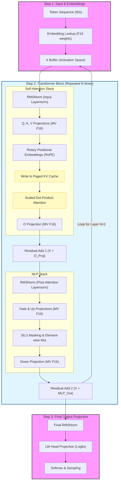

# cellm Inference Graph

This document visualizes the computation graph implemented in `crates/cellm-model/src/llama_graph.rs`. The graph is optimized for **Metal** execution on Apple Silicon, fusing layer operations into a single command buffer dispatch.

### Execution Strategy: `step_fused`
- **CPU Preparation**: Maps the `PageTable` to a buffer of block indices/offsets once per sequence.
- **Metal Command Buffer**: All layers are encoded into a single `MTLCommandBuffer`.
- **Zero-Copy Activations**: Intermediate buffers (Q, K, V, MLP) are pre-allocated in `LlamaGraphState` and reused across layers to minimize memory pressure.
- **Synchronization**: `cb.wait_until_completed()` is called exactly once after the entire model pass, ensuring maximum GPU occupancy.
