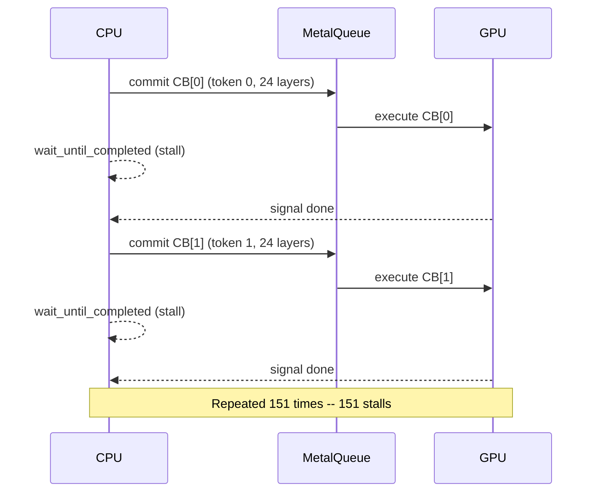
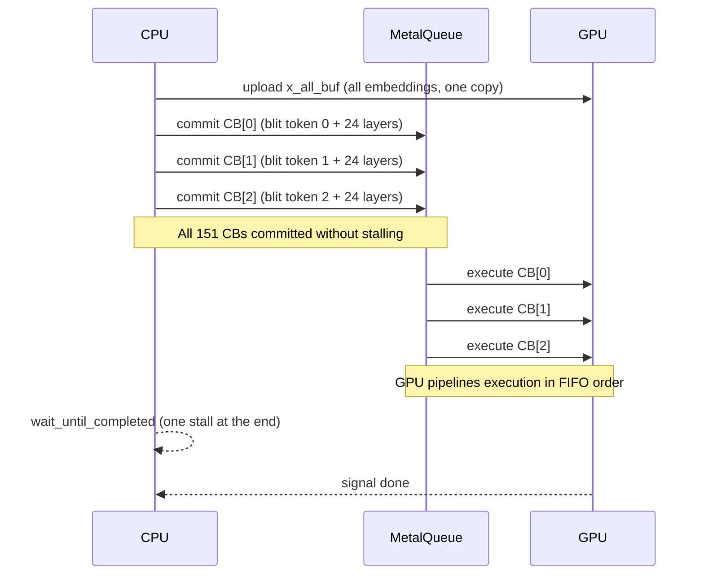
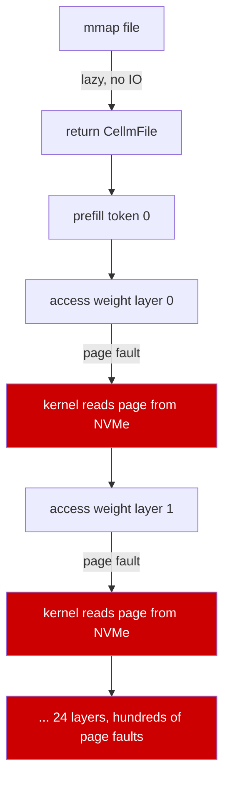
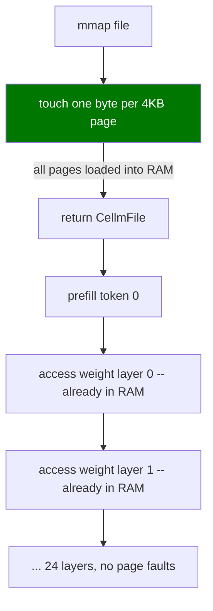

# Inference Optimization: CPU and Metal Backends

## Overview

This document describes the changes made to accelerate inference on both the Metal GPU backend (macOS and iOS) and the CPU backend for Qwen-family models in cellm.

---

## Part 1: Metal -- iOS Prefill Stall

### Problem

On iOS, prefill for a 151-token prompt was taking approximately 5.9 seconds, despite the macOS CLI completing the same prompt in under 0.5 seconds. Decode was also slow but roughly proportional to the hardware gap. The prefill cost was the outlier.

```
[CellmDebug] prefill done cache_hit=no prefill_ms=5888.5   (iOS)
Prefill: 15 tokens in 0.44s                                 (macOS CLI)
```

### Root Cause

`prefill_fused()` in `crates/cellm-model/src/qwen.rs` encoded and committed one Metal `CommandBuffer` per token, and called `wait_until_completed()` after each commit before encoding the next one.

```
for each token i in prompt:
    cb = queue.new_command_buffer()
    copy embedding[i] to x_buf   (CPU memcpy)
    encode all 24 layers into cb
    cb.commit()
    cb.wait_until_completed()     <-- CPU blocks here until GPU finishes
```

For 151 tokens, this produced 151 synchronous CPU-GPU round-trips. Each round-trip paid:

- GPU scheduler latency (submitting a new workload)
- CPU spin/sleep in `wait_until_completed`
- Apple Silicon QoS scheduling on iOS (stricter than macOS)

On macOS, the system GPU binary cache and lower scheduler latency masked this. On iOS, the app sandbox limits the GPU binary cache, raising cold-compile overhead per launch, and the GPU scheduler enforces tighter QoS.

### Dataflow Before



### Fix

1. Upload all token embeddings to GPU memory once as a single `MTLBuffer` (`x_all_buf`).
2. Each per-token `CommandBuffer` starts with a blit encoder that copies its embedding slice from `x_all_buf` into `x_buf` on the GPU -- no CPU write, no sync needed.
3. All 151 `CommandBuffer`s are committed to the queue without any `wait_until_completed` between them.
4. A single `wait_until_completed` is called on the last CB after all submissions.

The Metal queue is strictly FIFO. The GPU processes CBs in submission order, so KV-cache correctness is preserved. The CPU can encode CB[i+1] while the GPU is still executing CB[i].

### Dataflow After



### Pseudocode

```
// Before
for i in 0..num_tokens:
    cb = new_command_buffer()
    memcpy(x_buf, x_all[i], h * 4)         // CPU write
    for l in 0..num_layers:
        encode_layer(cb, l, ...)
    cb.commit()
    cb.wait_until_completed()               // stall
final_cb.commit()

// After
x_all_buf = device.new_buffer_with_data(x_all)  // one GPU upload
last_cb = None
for i in 0..num_tokens:
    cb = new_command_buffer()
    blit = cb.new_blit_command_encoder()
    blit.copy(x_all_buf, i*h*4, x_buf, 0, h*4)  // GPU-side copy
    blit.end_encoding()
    for l in 0..num_layers:
        encode_layer(cb, l, ...)
    cb.commit()                             // no stall
    last_cb = cb
if last_cb:
    last_cb.wait_until_completed()          // one stall at the end
final_cb.commit()
```

---

## Part 2: Metal -- Shader Library Cold-Compile Cost

### Problem

On a fresh app launch on iOS, MSL shader compilation took several seconds before the first token was produced. On macOS, this was masked by the system-wide GPU binary cache. iOS sandboxes each app's cache, making it evictable under memory pressure -- paying the full LLVM IR to AIR to GPU binary pipeline on each cold start.

### Fix

A process-lifetime static cache for each shader library, using `Mutex<Option<Library>>`.

```
// cellm-kernels/src/metal.rs
static ELEM_OPS_LIB_CACHE: Mutex<Option<Library>> = Mutex::new(None);

// cellm-cache/src/kvcache.rs
static KV_CACHE_LIB_CACHE: Mutex<Option<Library>> = Mutex::new(None);
```

On the first call to `MetalOps::create()`, the shader source is compiled and stored in the static. Every subsequent call clones the cached `Library` handle. Apple's Metal runtime deduplicates pipeline state objects that share the same underlying compiled library.

`fast_math_enabled(true)` was added to both compile paths. This enables FMA fusion and relaxed IEEE 754 compliance for the GPU dot-product kernels, which cuts GPU cycle count for attention and matmul.

### Pseudocode

```
fn get_library(device, source) -> Library:
    guard = CACHE.lock()
    if guard is None:
        options = CompileOptions::new()
        options.set_fast_math_enabled(true)
        guard = Some(device.new_library_with_source(source, options))
    return guard.as_ref().clone()
```

---

## Part 3: CPU -- Weight Page Faults During Inference

### Problem

`CellmFile::load()` maps the model file with a lazy `mmap`. No pages are read from disk at load time. The first access to each 16 KB OS page during inference causes a page fault -- the kernel reads that page from SSD into RAM.

For the Qwen 0.5B int8 model the weight file is approximately 500 MB. At 16 KB pages, the file contains ~32,000 pages. During the first prefill token, every weight tensor page that the transformer touches is read from disk for the first time. On Apple Silicon, reading 500 MB from NVMe takes 200-600 ms depending on IO scheduler state.

This showed up as the first prefill token being dramatically slower than subsequent ones.

### Fix

Touch one byte per OS page immediately after `mmap`, before returning from `load()`. This forces the kernel to read all pages into RAM once, at startup, rather than piecemeal during inference.

```
// crates/cellm-model/src/cellm_file.rs
const PAGE: usize = 4096;
let _ = (0..mmap.len()).step_by(PAGE).fold(0u8, |acc, i| acc | mmap[i]);
```

The read is aggregated with a fold to prevent the optimizer from eliminating it as dead code. The cost is paid entirely in `Startup: model header load` and does not appear in prefill timing.

### Dataflow Before vs After





---

## Part 4: CPU -- Serial Logits Loop

### Problem

The CPU logits computation called `dot_row()` once per vocabulary entry in a sequential loop:

```
for vid in 0..vocab:           // vocab = 151936
    logits[vid] = dot_row(weight_name, vid, hidden, x_final)
```

`dot_row()` performed a `HashMap::get()` on the tensor index for every call, then a scalar inner loop with software f16-to-f32 conversion per weight element. For `hidden = 896` and `vocab = 151936`, this is approximately 136 million scalar multiply-adds, serialized, with 151936 HashMap lookups.

### Fix

Replace the loop with `matmul_i8_f32()` (for int8 weights) or `matmul_f16_f32()` (for f16 weights), which use Rayon for parallel dispatch across vocab rows and NEON intrinsics for the inner product.

```
// Before
for vid in 0..vocab:
    logits[vid] = dot_row(weight, vid, hidden, x_final)

// After
match dtype:
    "i8"  => matmul_i8_f32(w, scales, vocab, hidden, x_final, logits)
    "f16" => matmul_f16_f32(w, vocab, hidden, x_final, logits)
    _     => fallback serial loop
```

`matmul_i8_f32` is already parallelized with `out.par_iter_mut()` (Rayon) and uses a NEON unrolled loop with `vld1q_s8` + `vmovl_s8` + `vmlaq_f32` for the inner product. On a 10-core M-series chip, this dispatches ~15000 rows per thread.

---

## Part 5: CPU -- matmul_f16_f32 Broken NEON

### Problem

The NEON path in `matmul_f16_f32` was not actually using hardware f16-to-f32 conversion. It called `f16::from_bits(x).to_f32()` (software conversion through the `half` crate) for each of the 8 elements per loop iteration, then used `vsetq_lane_f32` to move each result from the general-purpose register file into NEON registers. This pattern forces a GPR-to-NEON transfer per lane, which stalls the NEON pipeline.

The effective throughput was worse than a simple scalar loop because the scalar work happened in GPR and was then funneled into NEON for the multiply-add.

### Fix

Replace the software conversion and `vsetq_lane_f32` approach with a pure NEON bit-manipulation conversion using only stable intrinsics. `vcvt_f32_f16` (FCVTL) would be ideal but requires the `stdarch_neon_f16` feature gate, which is unstable in Rust 1.92.

The bit-manipulation approach converts 4 f16 values to f32 values entirely in NEON registers using integer bitwise operations:

```
sign   = (bits & 0x8000) << 16
exp    = (bits & 0x7c00) + 0x1c000, shifted left 13
mant   = (bits & 0x03ff) << 13
zero   = if (bits & 0x7c00) == 0 then force result to zero
f32    = sign | (exp | mant) & zero_mask
```

This produces 4 f32 values in a NEON register in approximately 6 instructions, with no GPR-to-NEON transitions.

### Pseudocode

```
inline fn f16x4_to_f32x4(ptr: *const u16) -> float32x4_t:
    h    = vld1_u16(ptr)           // load 4 x f16 bit patterns
    w    = vmovl_u16(h)            // zero-extend to 4 x u32
    sign = (w << 16) & 0x80000000 // extract sign bit to f32 position
    norm = (w & 0x7fff + 0x1c000) << 13   // shift exp+mantissa to f32
    mask = w & 0x7c00 != 0         // nonzero if not zero/subnormal
    return (sign | (norm & mask)) as float32x4_t

// Main loop
while i + 16 <= k:
    xv0..3 = vld1q_f32(b + i + 0..12)     // load 4x4 f32 activations
    wf0..3 = f16x4_to_f32x4(row + i + 0..12) // convert 4x4 f16 weights
    sum0 = vmlaq_f32(sum0, wf0, xv0)
    sum1 = vmlaq_f32(sum1, wf1, xv1)
    sum2 = vmlaq_f32(sum2, wf2, xv2)
    sum3 = vmlaq_f32(sum3, wf3, xv3)
    i += 16
```

Processing 16 elements per iteration with 4 independent accumulator lanes allows the CPU's out-of-order engine to overlap load, convert, and multiply-add operations across iterations.

---

## Results

### Metal (iOS)

The prefill time for a 151-token chat prompt dropped from 5.9 seconds to well under 1 second after the pipelined prefill submission and shader library caching fixes.

### CPU (macOS, aarch64)

Same prompt and model (Qwen 2.5 0.5B int8), 100 generated tokens:

| Metric | Before | After | Speedup |
|---|---|---|---|
| Prefill (28 tokens) | 8.13s | 1.08s | 7.5x |
| Decode (100 tokens) | 27.16s | 3.50s | 7.8x |
| Decode per token | 272ms | 35ms | 7.8x |

CPU decode at 35ms/token is approximately 1.8x slower than Metal at 19ms/token, which is the expected ratio given that Metal runs the weight matmuls as GPU kernels with higher arithmetic throughput.

---

## Files Changed

| File | Change |
|---|---|
| `crates/cellm-model/src/qwen.rs` | Pipelined prefill submission; CPU logits uses matmul kernels |
| `crates/cellm-model/src/cellm_file.rs` | mmap page pre-warm at load time |
| `crates/cellm-kernels/src/metal.rs` | Static `ELEM_OPS_LIB_CACHE` + fast_math |
| `crates/cellm-cache/src/kvcache.rs` | Static `KV_CACHE_LIB_CACHE` + fast_math |
| `crates/cellm-kernels/src/cpu_kernels.rs` | NEON f16x4-to-f32x4 conversion via bit manipulation |
