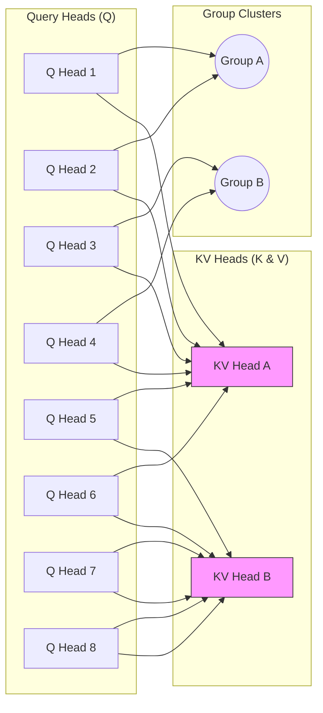

# Lesson: Grouped Query Attention (GQA)

This lesson explains the mechanism used in models like **LLaMA 2/3** and **Mistral** to drastically reduce memory usage during inference without sacrificing model quality.

## Core Concepts

In standard **Multi-Head Attention (MHA)**, every Query (Q) head has its own dedicated Key (K) and Value (V) head. This means the memory cost of the KV cache scales linearly with the number of heads. **Grouped Query Attention (GQA)** breaks this 1-to-1 relationship.

### How GQA Works
GQA groups the query heads into clusters, and each **group** shares a single KV head. 
*   **MHA (Multi-Head Attention)**: 8 Q heads ↔ 8 KV heads.
*   **GQA (Grouped Query Attention)**: 8 Q heads ↔ 2 KV heads (Groups of 4).
*   **MQA (Multi-Query Attention)**: 8 Q heads ↔ 1 KV head (All share one).

## Why It Matters: The KV Cache Problem

During inference, we store the Keys and Values for every token seen so far to avoid recomputing them (this is the **KV Cache**). For long sequences or high-batch-size serving, this cache becomes the primary memory bottleneck.

### Sample Math: LLaMA 3 (8B) 
Let's look at the memory cost for a single sequence with **2048 tokens** in **FP32** (4 bytes per element):

**Model Specs:**
*   **Hidden Size**: 4096
*   **Default Heads**: 32
*   **GQA Groups**: 8 KV heads (Group size of 4)
*   **Head Dim**: $4096 / 32 = 128$

#### Case 1: Multi-Head Attention (MHA)
If we had 32 KV heads:
$$Memory = 2 \text{ (K and V)} \times \text{Layers (32)} \times \text{Heads (32)} \times \text{HeadDim (128)} \times \text{Seq (2048)} \times 4 \text{ bytes}$$
$$Memory = 2 \times 32 \times 32 \times 128 \times 2048 \times 4 \approx \mathbf{2.14 \text{ GB}}$$

#### Case 2: Grouped Query Attention (GQA)
Using 8 KV heads (actual LLaMA 3 configuration):
$$Memory = 2 \text{ (K and V)} \times \text{Layers (32)} \times \text{Heads (8)} \times \text{HeadDim (128)} \times \text{Seq (2048)} \times 4 \text{ bytes}$$
$$Memory = 2 \times 32 \times 8 \times 128 \times 2048 \times 4 \approx \mathbf{536 \text{ MB}}$$

**Result**: We reduced the memory footprint by **75%** while maintaining the high number of query projections (32) that represent the model's "thinking" capacity.

---

## The Attention Spectrum

| Regime | Ratio (Q:KV) | Memory Cost | Quality | Used In |
| :--- | :--- | :--- | :--- | :--- |
| **MHA** | 1 : 1 | Highest | Best | GPT-3, LLaMA 1 |
| **GQA** | N : 1 | **Optimized** | High | **LLaMA 3, Mistral** |
| **MQA** | All : 1 | Lowest | Moderate | Falcon, PaLM |

> [!TIP]
> GQA is the "Goldilocks" regime: it provides nearly the same accuracy as MHA but with the memory efficiency required for high-concurrency mobile serving.
