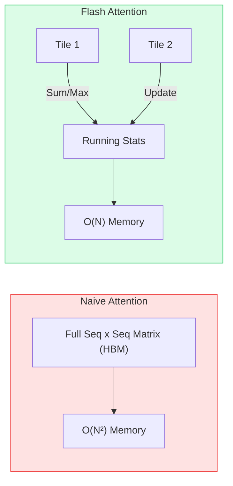
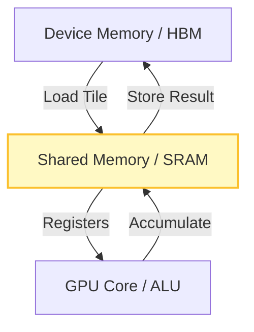
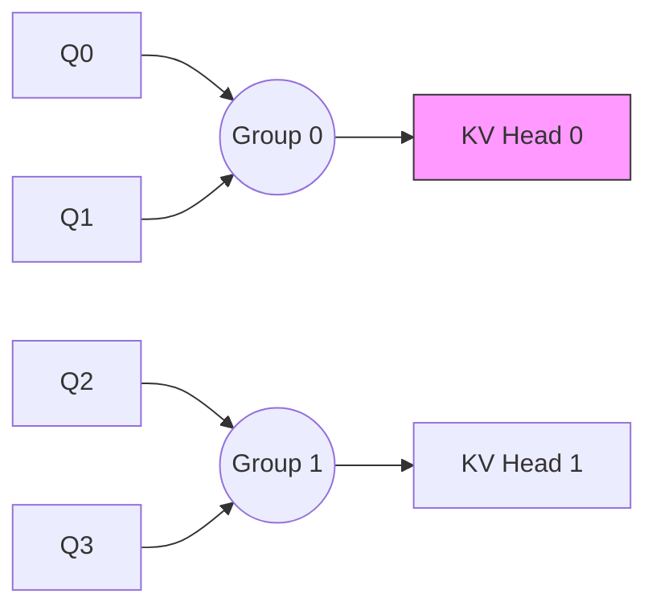
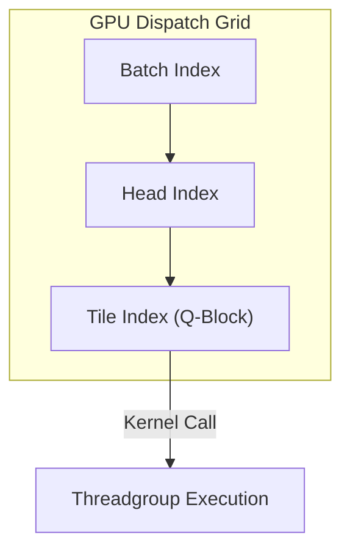
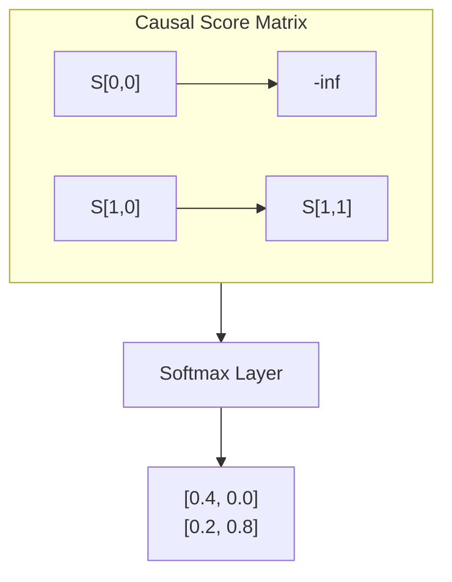
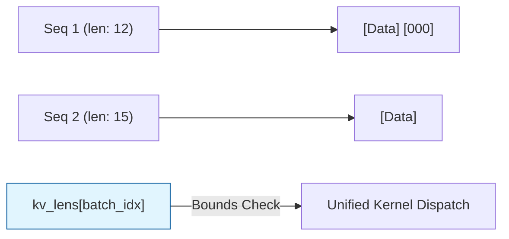

# Lesson: High-Performance GPU Kernels

This lesson breaks down six critical concepts for understanding how modern LLM inference engines (like **cellm**) achieve high performance on mobile GPUs.

---

## 1. Flash Attention
Standard attention computes a full $N \times N$ score matrix in global memory (HBM). Flash Attention uses **tiling** and **online-softmax** to keep memory usage linear in sequence length.

---

## 2. Tiled Execution
To minimize slow trips to device memory (HBM), we load blocks of data into **threadgroup shared memory** (SRAM). Computation happens in fast registers before results are written back.

---

## 3. GQA Mapping
Grouped Query Attention (GQA) fans Query heads down to shared KV heads. If we have 8 Q heads and 4 KV heads ($G=2$), the implementation is a simple integer division.

**Formula**: `kv_head = q_head / G`

---

## 4. Grid Shape (3D Dispatch)
The GPU dispatches a 3D grid of threadgroups. This allows the hardware to schedule work freely across all available compute units.

*   **X Axis**: Q-Tiles (Sequence blocks)
*   **Y Axis**: Attention Heads
*   **Z Axis**: Batch Items (Independent sequences)

---

## 5. Causal Masking
In autoregressive decoding, tokens cannot "look ahead." We apply a lower-triangular mask by setting scores above the diagonal to $-\infty$. During softmax, $e^{-\infty}$ becomes 0.

---

## 6. Variable-Length Sequences
Batches often contain sequences of different lengths. We use a `kv_lens` array to inform the kernel where the "real" data ends. The tile loader pads the rest with zeros so the GPU can process the batch in one go.

