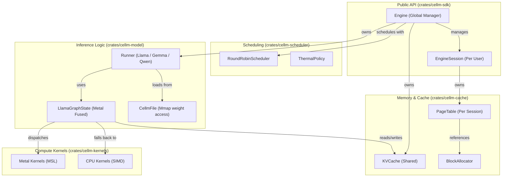
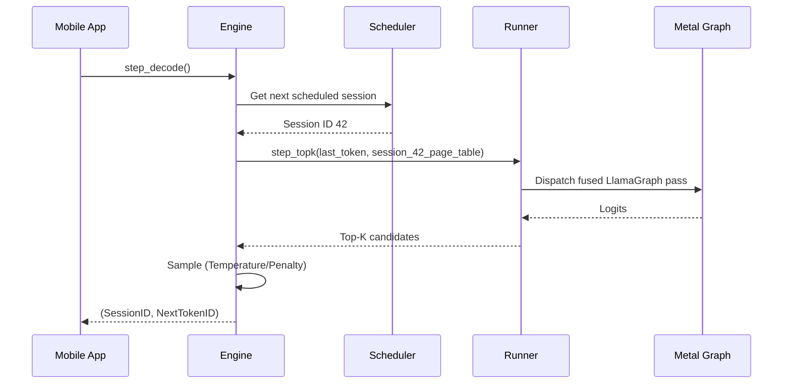

# cellm Project Architecture

This document provides a high-level overview of the **cellm** engine architecture, showing how the various crates and components interact to provide multi-session LLM inference on mobile devices.

## System Overview

The engine follows a layered architecture designed for extreme memory efficiency and predictable performance on memory-constrained devices.

### Key Components

#### 1. The `Engine` (`cellm-sdk`)
The primary entry point for mobile integrations (iOS/Android). It manages the global state:
- Shared **KVCache** for all active sessions.
- The active **Model Runner**.
- The **Scheduler** for interleaved decoding.

#### 2. Paged KV Cache (`cellm-cache`)
Inspired by vLLM but optimized for mobile:
- **BlockAllocator**: Manages a fixed pool of memory blocks (pages) to prevent fragmentation.
- **PageTable**: Maps logical token positions to physical blocks in the cache. This allows sessions to grow dynamically without contiguous memory allocations.

#### 3. Fused Inference Graph (`cellm-model`)
Instead of issuing many small GPU commands, **cellm** uses a "Graph" approach:
- Compiles the entire model pass into a single Metal command buffer.
- Minimizes CPU-to-GPU synchronization by waiting only at the end of the full forward pass.

#### 4. Thermal Policy (`cellm-scheduler`)
Monitors device health and adjusts the scheduler frequency.
- Can pause background sessions if the device reaches critical temperature.
- Prioritizes completion of active user prompts.

## Data Flow (Single Token Decode)

