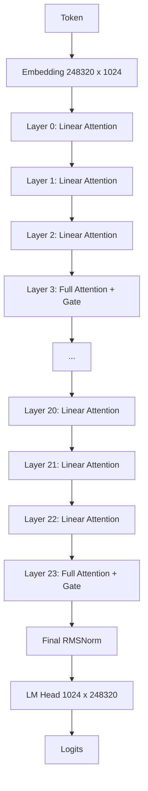
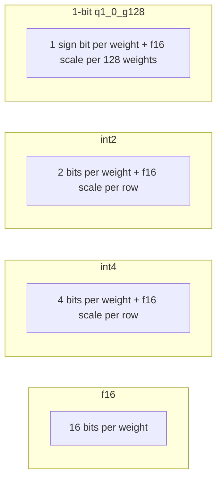
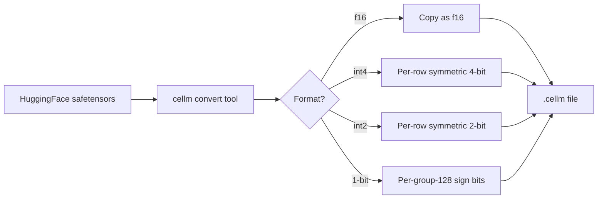
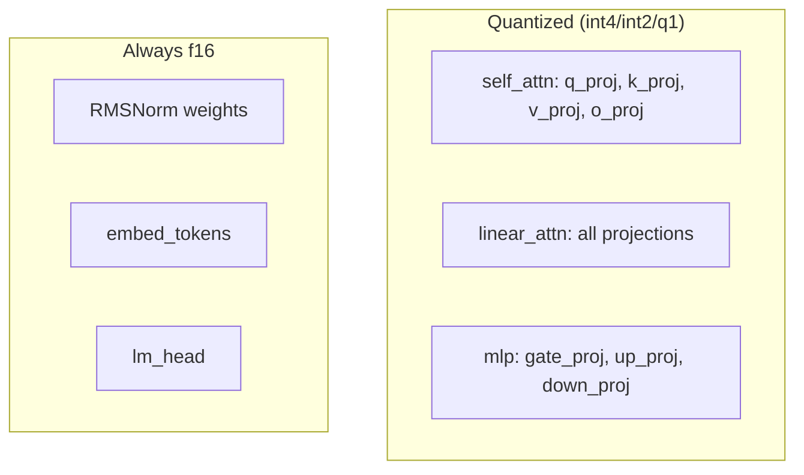
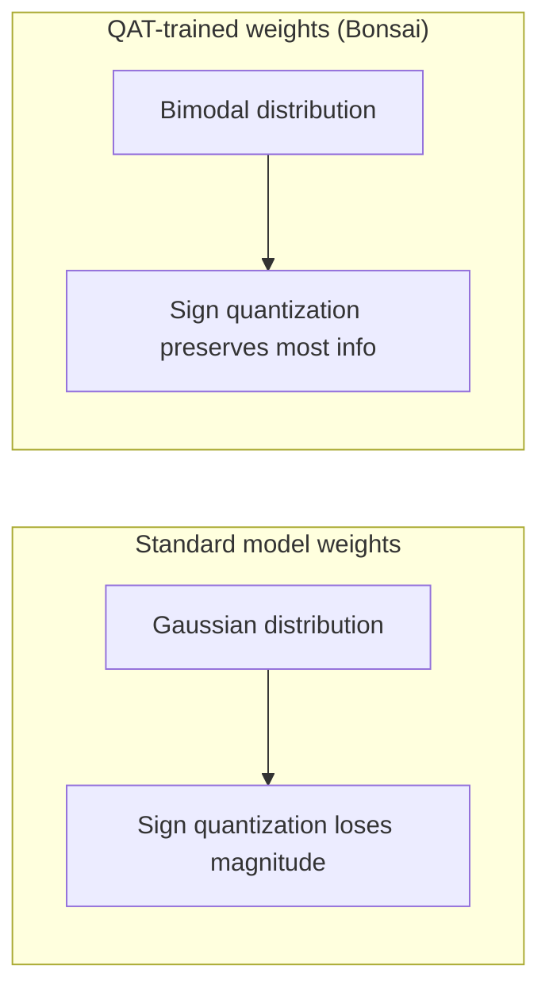
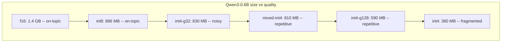

# Qwen3.5-0.8B Quantization Study

## Summary

We quantized Qwen3.5-0.8B to f16, int4, int2, and 1-bit formats using post-training quantization (PTQ) in the cellm inference engine. Only f16 and int4 produce coherent output. int2 and 1-bit produce garbage at this model size. This confirms that sub-4-bit PTQ needs quantization-aware training (QAT) for small models.

## Model

Qwen3.5-0.8B is a hybrid attention model from Alibaba. It uses two types of attention layers:

- **Linear attention** (DeltaNet/gated delta rule): 18 of 24 layers. Runs in constant memory per token using a recurrent state instead of a KV cache.
- **Full attention** (standard grouped-query attention with output gate): 6 of 24 layers. Uses a standard KV cache.

The layer pattern repeats: 3 linear, 1 full, 3 linear, 1 full, and so on.

```
hidden_size    = 1024
num_layers     = 24
num_heads      = 8
num_kv_heads   = 2
head_dim       = 128
intermediate   = 3584
vocab          = 248320
rope_theta     = 10000000
```

## Architecture



## Quantization formats

Each format replaces the f16 weight values with a compressed representation.



### q1_0_g128 block layout

Each block covers 128 weights and takes 18 bytes:

```
[f16 scale: 2 bytes] [128 sign bits packed: 16 bytes]
```

The scale is the mean of absolute values in the group. Each weight reconstructs as either `+scale` or `-scale` depending on the sign bit.

### int4 layout

Each row of the weight matrix stores 4-bit values packed two per byte, plus one f16 scale per row.

### int2 layout

Each row stores 2-bit values packed four per byte, plus one f16 scale per row. The four centroids are {-1.5, -0.5, +0.5, +1.5} times the scale.

## Quantization pipeline



### What gets quantized

Not all tensors get quantized. Norms stay in f16 because they are small and sensitive. For int2 and 1-bit, embeddings and the LM head also stay in f16 to protect the token mapping.



## Results

| Format | File size | Compression | Output quality |
|--------|-----------|-------------|----------------|
| f16 | 1.6 GB | 1x | Excellent. Identifies as Qwen3.5, answers questions correctly. |
| int4 | 755 MB | 2.1x | Good. Coherent, identifies as Qwen3.5, minor repetition at long lengths. |
| int2 | 836 MB | 1.9x | Incoherent. Random tokens and characters. |
| 1-bit | 200 MB | 8x | Incoherent. Degenerate loops and nonsense. |

Note: int2 is larger than int4 because int2 keeps embeddings and LM head in f16 (508 MB for the 248K vocab embedding alone) while the earlier int4 model quantized everything.

### Example output: "Hello, who are you?"

**f16:**
> Hello! I'm Qwen, a large language model created by Alibaba Cloud...

**int4:**
> Hello! I'm Qwen3.5, the latest large language model developed by Tongyi Qianxi...

**int2:**
> (garbage characters and random tokens)

**1-bit:**
> )sst,)))))))))-

## Why 1-bit fails at 0.8B

Post-training quantization maps each weight to the nearest quantized value. At 1 bit, every weight becomes either +scale or -scale. The information loss is massive:

1. **Magnitude information is destroyed.** A weight of 0.01 and a weight of 0.90 both become +scale. The model relies on magnitude differences to route information.

2. **0.8B parameters is already small.** There is not enough redundancy in the weight matrices for the model to tolerate losing all magnitude information.

3. **Embeddings are critical.** The embedding table maps 248K tokens to 1024-dim vectors. At 1 bit, all token embeddings become nearly binary, making it impossible to distinguish similar tokens.

Bonsai (PrismML) achieves good 1-bit quality by training models from scratch with quantization-aware training. The weights learn to be bimodal during training, so sign quantization loses very little information. Standard model weights follow a Gaussian distribution where sign quantization is destructive.



## Practical guidance

- For deployment at 0.8B: use int4 (755 MB). It is the smallest format that works.
- For research or size targets below 300 MB: use 1-bit but expect incoherent output. Consider a larger base model (9B+) where 1-bit PTQ has a better chance.
- For best quality: use f16 (1.6 GB).

## Files

All models live in `models/to-huggingface/`:

```
qwen3.5-0.8b-v1/
  qwen3.5-0.8b-f16.cellm   (1.6 GB)
  qwen3.5-0.8b-i4.cellm    (755 MB)
  qwen3.5-0.8b-q1.cellm    (200 MB)
  tokenizer.json
  README.md
```

## Commands

### Build

```sh
cargo build --release --bin infer
cargo build --release --bin convert
```

### Convert

```sh
# f16
./target/release/convert \
  --input models/hf/qwen3.5-0.8b \
  --output models/to-huggingface/qwen3.5-0.8b-v1/qwen3.5-0.8b-f16.cellm \
  --dtype f16

# int4
./target/release/convert \
  --input models/hf/qwen3.5-0.8b \
  --output models/to-huggingface/qwen3.5-0.8b-v1/qwen3.5-0.8b-i4.cellm \
  --quantize-int4-symmetric

# 1-bit
./target/release/convert \
  --input models/hf/qwen3.5-0.8b \
  --output models/to-huggingface/qwen3.5-0.8b-v1/qwen3.5-0.8b-q1.cellm \
  --quantize-int1-symmetric
```

### Inference

```sh
# f16
./target/release/infer \
  --model models/to-huggingface/qwen3.5-0.8b-v1/qwen3.5-0.8b-f16.cellm \
  --tokenizer models/to-huggingface/qwen3.5-0.8b-v1/tokenizer.json \
  --prompt "Hello, who are you?" \
  --chat --chat-format auto \
  --gen 64 --temperature 0 --backend cpu --kv-encoding f16

# int4
./target/release/infer \
  --model models/to-huggingface/qwen3.5-0.8b-v1/qwen3.5-0.8b-i4.cellm \
  --tokenizer models/to-huggingface/qwen3.5-0.8b-v1/tokenizer.json \
  --prompt "Hello, who are you?" \
  --chat --chat-format auto \
  --gen 64 --temperature 0 --backend cpu --kv-encoding f16

# 1-bit
./target/release/infer \
  --model models/to-huggingface/qwen3.5-0.8b-v1/qwen3.5-0.8b-q1.cellm \
  --tokenizer models/to-huggingface/qwen3.5-0.8b-v1/tokenizer.json \
  --prompt "Hello" \
  --gen 32 --temperature 0 --backend cpu --kv-encoding f16
```

---

## Appendix: Qwen3-0.6B quantization results

We also tested 8 variants of Qwen3-0.6B (a standard transformer, not hybrid attention). This is a base model (not instruction-tuned), so it only works for text completion.

### Variants tested

| File | Format | Size |
|------|--------|------|
| qwen3-0.6b-f16.cellm | f16 | 1.4 GB |
| qwen3-0.6b-f16-new.cellm | f16 (rebuilt) | 1.4 GB |
| qwen3-0.6b-int8.cellm | int8 | 866 MB |
| qwen3-0.6b-int4-g32.cellm | int4, group size 32 | 830 MB |
| qwen3-0.6b-mixed-int4.cellm | mixed int4 | 810 MB |
| qwen3-0.6b-int4-g128.cellm | int4, group size 128 | 590 MB |
| qwen3-0.6b-test-i4.cellm | int4 (test build) | 582 MB |
| qwen3-0.6b-int4.cellm | int4 (aggressive, all tensors) | 360 MB |

### Test: "The capital of France is"

All variants complete this prompt but fall into repetition loops at temperature 0. The f16 and int8 models stay on-topic ("the capital of France"). The int4 variants degrade: g32 drifts to "United States", g128 loops on "the", and the aggressive int4 produces fragmented output.

### Test: "Explain what a computer is:" (temperature 0.7)

With sampling, output is more varied but still low-quality across all variants. This is expected for a 0.6B base model. The f16 model produces the most coherent (though still noisy) completions.

### Observations

- Qwen3-0.6B is too small to produce high-quality text even at f16.
- int8 preserves almost all of the f16 quality.
- int4 with group size 32 is a reasonable compression (830 MB) but introduces noise.
- Aggressive int4 (360 MB) is severely degraded.
- For instruction-following tasks, Qwen3.5-0.8B (which uses hybrid linear/full attention) is a much better choice.

### File location

All models are in `models/to-huggingface/qwen3-0.6b-v1/` with a shared `tokenizer.json`.


