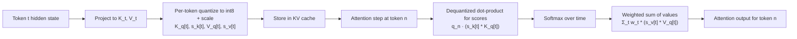

# TurboQuant Data Flow in `cellm`

This note explains how TurboQuant is used in the KV cache path.

## End-to-end flow

## Simple math

Per token `t`, for each channel `i`:

- Quantization:
  - `K_q[t, i] = round(K[t, i] / s_k[t])`
  - `V_q[t, i] = round(V[t, i] / s_v[t])`
- Dequantization:
  - `K̂[t, i] = s_k[t] * K_q[t, i]`
  - `V̂[t, i] = s_v[t] * V_q[t, i]`

Attention at decode token `n`:

- Score:
  - `score_t = (q_n · K̂[t]) / sqrt(d)`
- Weight:
  - `w_t = softmax(score)_t`
- Output:
  - `o_n = Σ_t w_t * V̂[t]`

## What this gives us

- Lower KV memory traffic (int8 payload + per-token scales).
- Strict backend behavior:
  - CPU uses CPU path.
  - Metal uses Metal path.
  - No automatic fallback.
