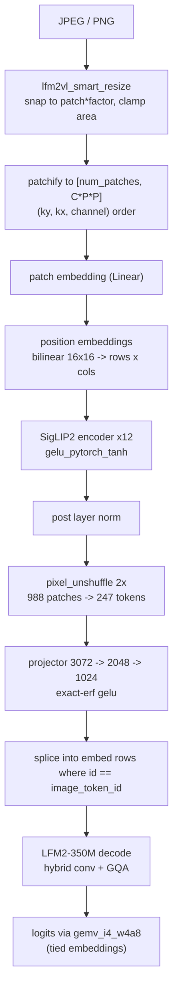

# LFM2.5-VL-450M: 856 MB to 271 MB

How `LiquidAI/LFM2.5-VL-450M` was brought into cellm, validated token-for-token
against the Hugging Face reference, and then quantized twice — first to INT8,
then to group-wise INT4 with a new ARM `SDOT` W4A8 kernel.

Final artifacts, all CPU:

| Build | Size     | Vision encode | Decode (48 tokens) |
| ----- | -------- | ------------- | ------------------ |
| f16   | 855.9 MB | 538 ms        | 34.2 s             |
| int8  | 429.7 MB | 486 ms        | 6.7 s              |
| int4  | 270.7 MB | 559 ms        | 4.4 s              |

Apple M4, `--backend cpu`, single 1024x768 image tile.

## The model

LFM2.5-VL-450M is a SigLIP2 NaFlex vision tower feeding an LFM2-350M language
model through a 2-layer MLP projector.

- **Language model**: 16 layers, hybrid LIV convolution + grouped-query
  attention, hidden 1024, 16 query / 8 key-value heads, vocab 65,536 with tied
  embeddings, RoPE theta 1,000,000. Attention runs at layers 2, 5, 8, 10, 12,
  14; short convolution everywhere else.
- **Vision tower**: siglip2, 12 layers, hidden 768, 12 heads, patch 16,
  `gelu_pytorch_tanh`, layer norm eps 1e-6.
- **Projector**: 3072 → 2048 → 1024, exact-erf gelu.

Two things in this stack could not be expressed by the existing cellm VLM path
and needed new code.

### NaFlex means the token count is image-dependent

The other vision models in cellm resize every image to a fixed square and emit a
fixed number of patch tokens. LFM2-VL does not. `smart_resize` snaps the native
aspect ratio to a multiple of `patch_size * downsample_factor` and clamps the
area between `min_image_tokens` and `max_image_tokens` worth of pixels. A
1024x768 photo becomes a 26x38 patch grid — 988 patches, which the 2x
pixel-unshuffle packs down to 247 tokens.

Consequences:

- The learned 16x16 position-embedding grid has to be bilinearly interpolated to
  the actual grid, per image, matching
  `F.interpolate(mode="bilinear", align_corners=False)`.
- The patch embedding is a plain `Linear` over pre-patchified rows, not a
  strided conv, so patches are built on the CPU side in `(ky, kx, channel)`
  order to match HF `convert_image_to_patches`.
- Any fixed processor hint for the token count is wrong by construction and must
  not be enforced.

The `pixel_unshuffle` ordering was the easiest thing to get subtly wrong. For
output cell `(oy, ox)`, sub-index `s` selects source patch
`(oy*f + s/f, ox*f + s%f)` — row offset outer, column inner. Swapping those two
still produces the right shape and plausible-looking output.

### Two different gelus

The SigLIP2 encoder MLP uses the tanh approximation (`gelu_pytorch_tanh`). The
projector uses exact erf gelu (`hidden_act: "gelu"`). Using one for both moves
the image features enough to break exact parity but not enough to look broken,
so the two are implemented separately: `gelu_pytorch_tanh_inplace` and
`gelu_erf_inplace` (Abramowitz & Stegun 7.1.26, max abs error ~1.5e-7).

### The config lies about the FF dimension

`text_config.intermediate_size` says 6656. The actual weights are 4608 wide —
LFM2 uses `block_auto_adjust_ff_dim`, so the published number is the pre-adjust
value. The converter reads the real dimension off the first `feed_forward.w1`
tensor shape and only falls back to the config value if no such tensor exists:

```python
# block_auto_adjust_ff_dim means config intermediate_size is not the real FF dim.
intermediate_size = shape[0]   # from feed_forward.w1
```

Trusting the config produces a shape-mismatch error at load time, which is the
good outcome. Silently padding would not be.

### Prompt tokens

LFM2-VL emits bare `<image>` repeats. The Idefics3-style wrapper tokens the
SmolVLM path inserts do not exist in this tokenizer, and adding them shifts
every position.

## Parity

The f16 build is the reference. Against Hugging Face with `min_tiles=1`,
`max_tiles=1`, `use_thumbnail=False`, `use_image_special_tokens=False`:

- `pixel_values` `(1, 1024, 768)`
- `spatial_shapes` `[[26, 38]]` — 988 patches → 247 tokens
- `image_features` `(247, 1024)`, mean `-0.37554914`, std `12.503794`
- generated text matches **exactly**

Everything after this point is measured against that build.

## INT8: 856 MB → 430 MB

Straightforward per-row symmetric INT8, applied to every 2D projection weight
including the tied embedding table:

```python
amax = w.abs().amax(dim=1, keepdim=True)
scale = (amax / 127.0).clamp(min=1e-12)
q = torch.round(w / scale).clamp(-127, 127).to(torch.int8)
```

Norms, biases, and the depthwise convolution kernels stay f16 — they are tiny
and precision-critical, so quantizing them costs accuracy and saves nothing.

Decode dropped from 34.2 s to 6.7 s. That is not primarily a precision effect:
the f16 path falls back to a scalar loop, while INT8 reaches the NEON `SDOT`
W8A8 kernel. The gap is a property of which kernels exist, not of the numeric
format.

This build also batches prefill, so it remains the better choice when prompts
are long relative to the number of tokens generated.

## INT4: 430 MB → 271 MB

### Per-row INT4 does not work

The obvious extension — one f16 scale per row, 15 levels — leaves those 15
levels to span an entire 1024- or 4608-wide row. Descriptions came out
recognisably related to the image but drifting: correct subject, invented
details.

### Group-wise scales

One scale per 64 weights keeps the step size local. The cost is 2 bytes of scale
per 32 bytes of weights, about **4.25 effective bits per weight**. Output then
tracks INT8 closely.

Layout, in `tools/convert_lfm_vl_hf.py`:

```python
amax = g.abs().amax(dim=2, keepdim=True)      # g is [rows, groups, 64]
scale = (amax / 7.0).clamp(min=1e-12)
q = torch.round(g / scale).clamp(-7, 7).to(torch.int8).view(rows, cols)

nib = (q + 8).to(torch.uint8)
packed = nib[:, 0::2] | (nib[:, 1::2] << 4)
```

Element `2i` occupies the low nibble, `2i+1` the high nibble. Values are stored
biased by +8 so the nibble range `0..15` covers `-7..=7`.

### The vision tower stays INT8

This is a hard constraint, not a tuning choice. `tensor_to_f32` in
`crates/cellm-sdk/src/vlm.rs` decodes f16, f32, bf16 and i8 — and nothing else.
A 4-bit weight anywhere under `model.vision_tower.*` or
`model.multi_modal_projector.*` fails outright at load.

It is also where you would least want it. The vision tower is a full
bidirectional encoder: quantization error there compounds across all 988 patch
tokens before the language model sees a single one. And it is only ~180 MB of
the 856 MB, so the size argument is weak. The eligibility check is explicit
about both reasons:

```python
def int4_eligible(name: str) -> bool:
    """Text-side weights only."""
    return not name.startswith(VISION_PREFIX) and not name.startswith(PROJECTOR_PREFIX)
```

### The W4A8 SDOT kernel

Dequantizing to f32 and reusing the f16 path would have given the size win and
none of the speed. `gemv_i4_w4a8` in `crates/cellm-kernels/src/cpu_kernels.rs`
consumes the packed nibbles directly, so a decode step moves half the bytes of
the INT8 path instead of eight times as many.

Two tricks make the inner loop pure load-and-`SDOT`.

**1. Deinterleave the activation, not the weights.** Masking and shifting a
16-byte weight load yields two vectors of *strided* weights — even elements from
the low nibbles, odd from the high. They only line up with the activations if
the activations are strided the same way. Doing that shuffle once per GEMV on
the activation, rather than on every weight row, keeps the weight stream — the
actual bandwidth cost — untouched:

```rust
let pair = vld2q_s8(xp.add(i * 2));
vst1q_s8(even.as_mut_ptr().add(i), pair.0);
vst1q_s8(odd.as_mut_ptr().add(i), pair.1);
```

**2. Remove the +8 bias algebraically.** Since
$\sum_j (n_j - 8)\,x_j = \sum_j n_j x_j - 8\sum_j x_j$ over a group, and the
group activation sums are identical for every output row, the correction costs
one multiply per group instead of a `vsub` in the inner loop:

```rust
let acc = vaddvq_s32(acc_e) + vaddvq_s32(acc_o);
// Undo the +8 storage bias for the whole group at once.
let gs = f16::from_bits(scales_f16[srow + g]).to_f32();
dot += (acc - 8 * x_group_sums[g]) as f32 * gs;
```

The loop then runs at two `SDOT`s per 16 weight bytes — one for the even lane,
one for the odd.

The same packed format is wired into the tied-embedding paths in
`crates/cellm-model/src/lfm.rs`: the logits projection (the single largest matmul
in the model) goes through `gemv_i4_w4a8`, and single-token embedding lookup
unpacks one row of nibbles directly rather than materialising the table.

## Reproducing

Convert from Hugging Face weights:

```bash
# f16 reference
python tools/convert_lfm_vl_hf.py <hf_dir> lfm2.5-vl-450m-f16-v1.cellm

# int8 everywhere, including the vision tower
python tools/convert_lfm_vl_hf.py <hf_dir> lfm2.5-vl-450m-int8-v1.cellm \
  --quantize-int8 --quantize-vision

# int4 language model, int8 vision tower
python tools/convert_lfm_vl_hf.py <hf_dir> lfm2.5-vl-450m-int4-v1.cellm \
  --quantize-int4 --quantize-vision
```

Run:

```bash
cargo build --release -p vlm-smoke

CELLM_VLM_TOKENIZER=tokenizer.json ./target/release/vlm-direct \
  --model lfm2.5-vl-450m-int4-v1.cellm \
  --image photo.jpg \
  --backend cpu \
  --tokens 48
```

`CELLM_VLM_TOKENIZER` is required — the resolver falls back to a small set of
conventional filenames next to the model and otherwise bails. Set
`CELLM_STEP_TIMING=1` to print the patch grid, token counts and per-stage
encoder timings.

## Pipeline



## Published builds

All three are on Hugging Face under `jeffasante/cellm-models` in `vision/`:

- `vision/lfm2.5-vl-450m-f16-v1` — reference, use it to validate changes
- `vision/lfm2.5-vl-450m-int8-v1` — batched prefill, best for long prompts
- `vision/lfm2.5-vl-450m-int4-v1` — smallest, the one to use on phones

Each folder ships the `.cellm` file and its `tokenizer.json`.

## Limitations

- **Metal is not implemented** for the LFM2-VL runner. Use `--backend cpu`.
- The `SDOT` path is aarch64-only; other targets fall back to scalar.
- INT4 does not batch prefill, so long prompts favour the INT8 build.
- This is a 450M model. It describes scenes well but misreads fine detail and
  text in images. Treat output as drafting material.
