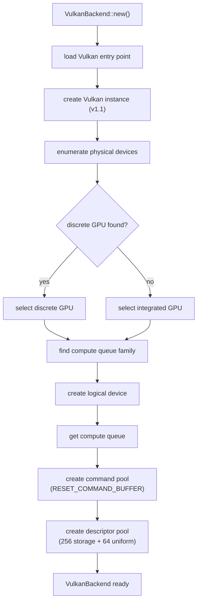
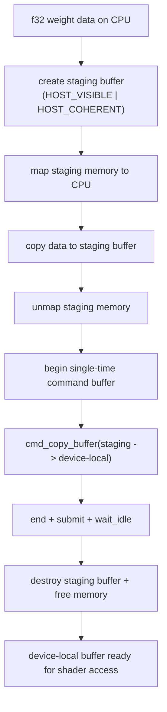
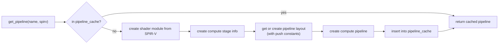
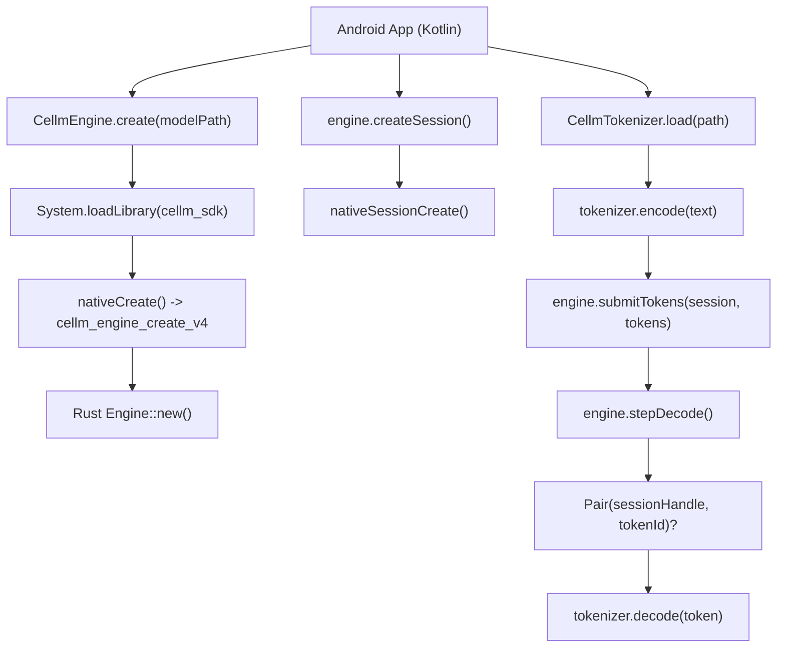

# Vulkan: Backend Scaffolding (Compute Kernels Not Yet Implemented)

> **Status.** This is research scaffolding, not a working GPU backend. The
> Vulkan device, queues, pipeline cache, and buffer management all work, but
> none of the compute kernels are written yet. Every op — matmul, rms_norm,
> rope, silu, add, mul, softmax, attention — returns an error and callers fall
> back to CPU. The embedded SPIR-V is a 32-byte placeholder, the same bytes for
> every kernel name. Enabled behind the optional `vulkan` feature.

This document describes the Vulkan backend scaffolding in cellm: what is in
place, how it is structured, and what still has to be built before it can run
inference on a GPU.

For the Kotlin Android AAR bindings, see
[Building the Android AAR](building-the-android-aar.md).

---

## What's In Place

1.  **VulkanBackend** -- Instance, device, queue, pipeline, and buffer
    management for Vulkan 1.1, implementing the `Backend` trait. This replaces
    the empty `pub struct VulkanKernels;`. It sets up everything a compute
    backend needs, but the compute shaders themselves are stubs.

2.  **Kotlin AAR bindings** -- Android library wrapping the cellm C FFI in
    idiomatic Kotlin. Includes `CellmEngine`, `CellmSession`, and
    `CellmTokenizer` classes with lifecycle management. These are independent of
    Vulkan and run against the CPU backend.

## What's Not

- No compute kernel is implemented. Every entry in the op table below is a stub.
- No real SPIR-V. `spirv_for_kernel()` ignores its argument and returns the same
  32-byte placeholder module regardless of which kernel was requested.
- The build skips SPIR-V compilation entirely if `glslangValidator` is absent.
- Nothing here has been validated on a physical Android device.

---

## Architecture

### Vulkan Backend Initialization



### Buffer Upload Pipeline



### Pipeline Compilation and Caching



### Kotlin AAR Data Flow



---

## VulkanBackend Structure

```
VulkanBackend
  device:          ash::Device              -- logical device handle
  queue:           ash::vk::Queue           -- compute queue
  command_pool:    ash::vk::CommandPool     -- command buffer allocation
  pipeline_cache:  Mutex<HashMap<String, Pipeline>>  -- compiled pipelines
  pipeline_layouts: Mutex<HashMap<String, PipelineLayout>>
  descriptor_pool: ash::vk::DescriptorPool  -- descriptor set allocation
  _instance:       ash::Instance            -- Vulkan instance (held for lifetime)
  _physical_device: ash::vk::PhysicalDevice -- selected GPU
  workgroup_count: u32                     -- dispatch size (default 256)
  shared_mem_size: usize                    -- shared memory limit (32KB)
```

### Backend Trait Implementation

All nine ops from the `Backend` trait are wired up, but none of them compute
anything on the GPU yet:

| Op | Implementation Status |
|---|---|
| `matmul` | Stub: returns error directing to CPU backend |
| `rms_norm` | Stub |
| `rope_inplace` | Stub |
| `silu` | Stub |
| `add` | Stub |
| `mul` | Stub |
| `softmax_inplace` | Stub |
| `attention` | Stub |
| `kv_write/read` | Default CPU implementations (inherited from trait) |

Each stub returns a descriptive `CoreError::Backend` explaining the op is not
yet implemented. The default `kv_write_token_f16`/`kv_read_token_f16` methods
from the `Backend` trait provide CPU-side KV cache access regardless of backend.

### Memory Model

```
Device-local memory (VK_MEMORY_PROPERTY_DEVICE_LOCAL_BIT):
  - Model weights (uploaded once at startup via staging buffer)
  - KV cache buffers (persistent across decode steps)

Host-visible memory (HOST_VISIBLE | HOST_COHERENT):
  - Staging buffers for uploads (allocated and freed per transfer)
  - Activation buffers for CPU readback

Push constants (fast, per-dispatch parameters):
  - KernelParams { m, n, k, batch, eps, theta }
  - 32 bytes total, updated per dispatch
```

The Kotlin AAR API surface and Gradle configuration moved to
[Building the Android AAR](building-the-android-aar.md).

---

## SPIR-V Shader Embedding

A minimal valid SPIR-V module (32 bytes) serves as a placeholder for compiled
compute shaders. In production, shaders are compiled from GLSL at build time
using `glslangValidator` or `shaderc` and embedded via `include_bytes!`.

The `spirv_for_kernel(name)` function provides shader bytecode by name.
Currently all kernels return the same placeholder. The production path replaces
this with:

```rust
pub fn spirv_for_kernel(name: &str) -> &'static [u8] {
    match name {
        "matmul_f32" => include_bytes!(concat!(env!("OUT_DIR"), "/shaders/matmul_f32.spv")),
        "attention_f32" => include_bytes!(concat!(env!("OUT_DIR"), "/shaders/attention_f32.spv")),
        // ... etc
        _ => &SPIRV_STUB_BYTES,
    }
}
```

---

## Files Changed

### New files

```
crates/cellm-kernels/src/vulkan.rs              VulkanBackend implementation (530 lines)
bindings/kotlin/src/main/kotlin/com/cellm/sdk/CellmEngine.kt
bindings/kotlin/src/main/kotlin/com/cellm/sdk/CellmSession.kt
bindings/kotlin/src/main/kotlin/com/cellm/sdk/CellmTokenizer.kt
```

### Modified files

```
crates/cellm-kernels/Cargo.toml        Replaced dash typo with ash 0.38 dependency
crates/cellm-kernels/src/lib.rs        Export VulkanBackend instead of VulkanKernels
bindings/kotlin/build.gradle           Updated with full AAR configuration
```

---

## Build Instructions

### Android AAR

```bash
# Cross-compile Rust library for Android
cargo build --release --target aarch64-linux-android -p cellm-sdk

# Copy native library into Kotlin project
cd bindings/kotlin
./gradlew copyNativeLibs

# Build AAR
./gradlew assembleRelease
# Output: bindings/kotlin/build/outputs/aar/cellm-sdk-release.aar
```

### Vulkan backend (desktop test)

```bash
cargo build -p cellm-kernels --features vulkan
cargo test -p cellm-kernels --lib
```

---
 